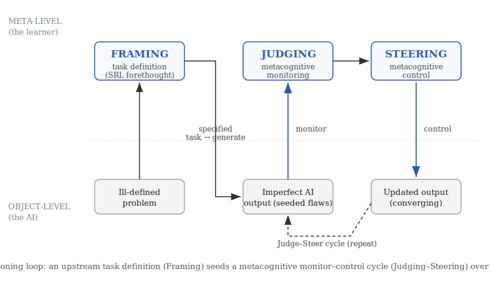
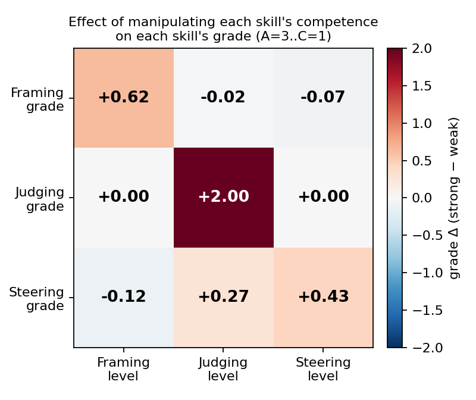
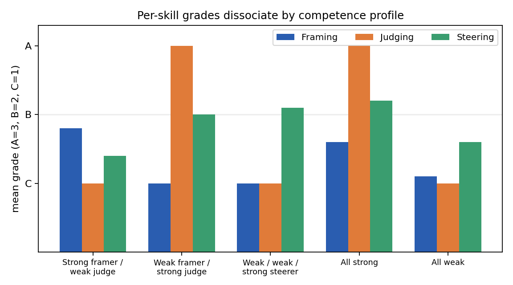
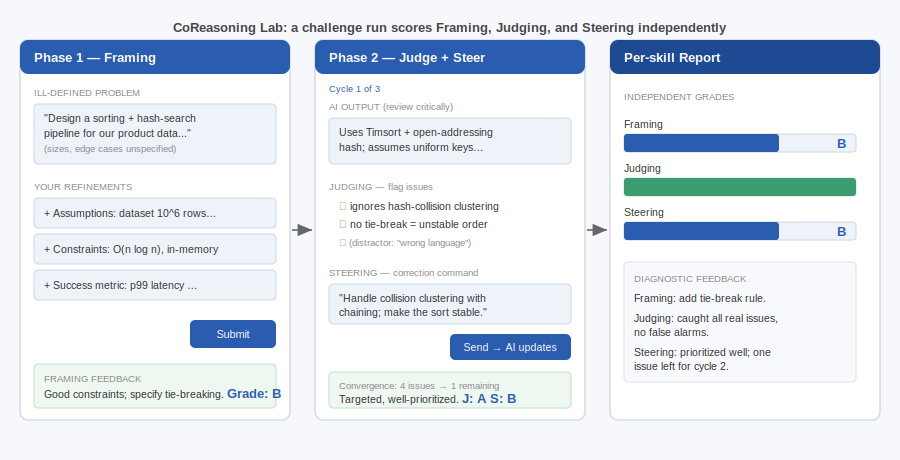

# Framing, Judging, Steering: An Assessable Competency Model for Reasoning With Generative AI

*Working draft — arXiv preprint. Target: Computers & Education: AI (Position Paper) / AIED Blue Sky / IJAIED.*

## Abstract

Generative AI makes it trivial to obtain an answer and difficult to obtain understanding. As large
language models are absorbed into education, the dominant design objective has been speed-to-answer,
even as a growing body of evidence links uncritical AI use to cognitive offloading and weakened
critical thinking. We argue that the educational question is not whether students use AI but
*whether they use it as critical collaborators*, and that this capability can be named, decomposed,
and assessed. We propose **CoReasoning**, a competency model that factors productive work with
generative AI into three temporally and cognitively distinct, independently-assessable skills:
**Framing** (transforming an ill-defined problem into a well-specified task before invoking AI),
**Judging** (critically evaluating AI output for errors, gaps, unstated assumptions, and risk),
and **Steering** (iteratively redirecting the AI toward a better solution across cycles). The
central structural claim that distinguishes CoReasoning from existing AI- and prompt-literacy
frameworks is the *separation of the pre-generation skill (Framing) from the post-generation
corrective skill (Steering)*, with Judging as the epistemic gate between them. We ground each skill
in established theory (metacognitive monitoring and control; self-regulated learning; epistemic
vigilance and critical thinking; productive struggle), state five testable propositions about how
the skills relate, position the model against the nearest prior frameworks, and report a
proof-of-concept instrument together with a feasibility demonstration that the three skills
dissociate and can be measured automatically. We close with the tensions a mature account must
resolve and a concrete assessment-validation agenda.

## 1. Introduction

The introduction of generative AI into learning environments has, by default, optimized for the
wrong variable. Most AI-in-education tools shorten the path from question to answer. Yet the answer
was never the point of education: the cognitive work of specifying a problem, evaluating a candidate
solution, and improving it is where learning happens. When that work is delegated wholesale to a
machine, the learner is left with a correct artifact and an unchanged mind.

Recent evidence makes the stakes concrete. Frequent, uncritical AI use correlates with lower
critical-thinking performance, an effect mediated by cognitive offloading and most pronounced in
younger users (Gerlich, 2025). Controlled studies of AI-assisted writing report "metacognitive
laziness," in which learners bypass the self-regulatory processes of diagnosing, evaluating, and
revising (the 2024 essay-writing literature), and neurophysiological work describes an accumulation
of "cognitive debt" when an assistant carries the reasoning load (Kosmyna et al., 2025). At the same
time, field studies of professional AI use show that the benefit of AI is sharply conditional on the
user's skill in directing it: assistance helps inside a model's competence frontier and *harms*
outside it (Dell'Acqua et al., 2023), and the most effective users adopt an iterative, critical
"push-back-and-validate" mode rather than wholesale delegation (Randazzo et al., 2025).

These findings share a structure. The difference between productive and counterproductive AI use is
not access to AI; it is a *competency* that some learners exercise and others do not. If that
competency can be named and decomposed, it can be taught and assessed. Current AI-literacy assessment
can often tell us *that* a learner's AI use is unproductive but not *why*: whether they specified the
task badly, failed to detect the flaws in the output, or knew the flaws but could not correct them.
These are different failures with different remedies, and a single "prompting" score conflates them.

We propose **CoReasoning**, a competency model that decomposes productive work with generative AI into
three distinct skills, each independently assessable:

- **Framing.** Before invoking the AI, transform an ill-defined problem into a well-specified task:
  surface unstated assumptions, fix constraints and scope, and define what an adequate solution must
  satisfy. Framing is a problem-structuring skill exercised *prior to* generation.
- **Judging.** Given AI output, critically evaluate it as a knowledge claim: detect factual and
  logical errors, missing edge cases, unstated assumptions, and risks, and calibrate how far to rely
  on it. Judging is an evaluative, epistemic skill.
- **Steering.** Across one or more cycles, issue targeted corrective feedback that moves the AI's
  output measurably closer to an adequate solution. Steering is a control skill exercised *after*
  generation, in a loop with Judging.

**Contributions.** This paper makes the following contributions:

1. **A competency model** that decomposes productive work with generative AI into three temporally and
   cognitively distinct, independently-assessable skills, Framing, Judging, and Steering, whose
   defining novelty is the separation of the pre-generation skill (Framing) from the post-generation
   corrective skill (Steering) that prior frameworks fuse.
2. **A theoretical grounding** that maps each skill to established theory (metacognitive monitoring and
   control, self-regulated learning, epistemic vigilance and critical thinking, productive struggle)
   under a single unifying monitor-control architecture, so the decomposition is principled rather
   than ad hoc.
3. **Five testable propositions** about how the skills relate (framing gates the loop; judging gates
   steering; the skills dissociate; judging transfers less than framing; the model inverts cognitive
   offloading), turning a taxonomy into a framework with empirical commitments.
4. **A precise novelty positioning** against the nearest prior frameworks (AI-fluency, metacognitive-
   demands, prompt-literacy, and AI-literacy models), stating exactly what is and is not new.
5. **A proof-of-concept instrument and feasibility demonstration**, with cross-model controls, showing
   that the three skills can be scored automatically and that they dissociate, the central evidence
   against the charge that the decomposition merely relabels "prompting."
6. **A reproducible, released artifact** (the prompt-based instrument, a controlled-generation harness,
   and data) together with a fully prepared human-rater validation protocol for the community to run.

We make no learning-outcome claims; the empirical material is a feasibility demonstration of
*construct separability and measurability*, not an efficacy study.

## 2. The problem with current AI-literacy assessment

Existing instruments for assessing how students work with AI are not wrong so much as
under-resolved. Knowledge-oriented frameworks such as Long and Magerko (2020) and the UNESCO (2024)
student competency framework define AI literacy chiefly as *understanding AI systems*: what AI is,
what it can and cannot do, how it works, and how it should be governed. These are necessary, but they
say little about the *performance* of working with a model on a task. Prompt-literacy and
generative-AI-literacy models (Lo, 2023; Annapureddy et al., 2024) move closer to performance, but
they bundle task specification and iterative refinement into a single "prompting" competency and treat
evaluation of the output as a downstream check rather than a co-equal skill.

The cost of this coarse resolution is diagnostic. When a learner's AI use produces a poor result, a
single prompting score cannot tell an instructor *which* cognitive operation failed: did the learner
specify the task badly, so that the model solved the wrong problem; did they fail to detect the flaws
in an otherwise plausible output; or did they see the flaws but issue corrections too vague to fix
them? These are three different failures with three different remedies, teaching problem
specification, teaching critical evaluation, and teaching corrective communication, and an instrument
that cannot separate them cannot guide instruction. A diagnostic competency model must therefore
decompose the human-AI loop into the distinct operations that can each break, and must show that those
operations are in fact separable in learners. That is the gap CoReasoning addresses.

## 3. The CoReasoning framework

### 3.1 A monitor–control architecture with an upstream task-definition

The three skills are not an arbitrary list; they instantiate a well-understood cognitive
architecture. Nelson and Narens (1990) describe metacognition as a two-level system: an object level
(cognition itself) and a meta level (a dynamic model of the object level), linked by **monitoring**
(information flowing from object to meta) and **control** (commands flowing from meta to object).
In CoReasoning, the AI's generative process is the object level the learner supervises:

- **Judging is monitoring.** The learner compares AI output against an internal model of an adequate
  solution and registers discrepancies.
- **Steering is control.** The learner acts on the monitoring signal, issuing commands that change
  the object-level process.
- **Framing is task definition.** Before monitoring can occur, the learner must establish the
  *standards* against which output is judged. In the COPES model of self-regulated learning (Winne &
  Hadwin, 1998), task definition is the explicit first phase, and products are evaluated against
  internally held standards; mismatch triggers reprocessing. Framing is that task-definition phase
  applied to a human-AI loop: it sets the referent that makes Judging and Steering well-posed.

The Judge→Steer cycle is therefore a monitor→control loop seeded by a task definition. This is the
structural spine of the framework and the reason the three skills cohere rather than merely coexist
(Figure 1).

*Figure 1. The CoReasoning loop. An upstream task definition (Framing, a self-regulated-learning
forethought activity) sets the standards against which a metacognitive monitor–control cycle (Judging
then Steering) supervises a fallible AI at the object level. Judging is the monitor's read-out;
Steering is the controller's write.*

### 3.2 The temporal-separation claim (what makes the decomposition non-obvious)

Existing frameworks treat "use the AI well" as one skill or, at most, pair "prompt" with "evaluate."
CoReasoning's distinctive move is to separate two operations that prior models fuse: the
*pre-generation* skill of structuring the task (Framing) and the *post-generation* skill of correcting
the output (Steering). These are different cognitive acts at different points in time, with different
error modes and different instructional remedies. A learner can frame impeccably and steer poorly
(detect a flaw but issue a vague correction), or steer fluently atop a malformed task (drive the AI
energetically toward the wrong target). Collapsing both into "prompting" hides exactly the
distinctions an educator needs.

### 3.3 Distinguishing Judging from Steering

Because Judging and Steering both occur after generation and in a tight loop, their boundary needs
stating precisely. **Judging is assessment; Steering is action.** Judging produces a *representation
of what is wrong* with the current output, an internal or articulated list of detected flaws, gaps,
and risks, and a calibrated sense of how much to trust the output. It is evaluative and its output is
a diagnosis. Steering consumes that diagnosis and produces a *corrective instruction* aimed at
changing the next output: it is generative and directive, and its quality depends on prioritization
(addressing the most critical flaw first), specificity (an actionable command rather than "improve
this"), and effectiveness (whether the output actually converges). In the monitor-control terms of
Section 3.1, Judging is the monitor's *read-out* and Steering is the controller's *write*. The two
dissociate because the competencies differ: a learner may diagnose accurately yet communicate the fix
poorly (good Judging, weak Steering), or issue fluent, confident commands that target the wrong thing
because the diagnosis was wrong (weak Judging propagating into misdirected Steering, the failure mode
Proposition P2 predicts). This last point also reconciles an apparent tension: P2 (Judging bounds
Steering) implies the two grades will be *positively correlated* in the aggregate, while P3 claims they
*dissociate*. Both hold. P2 is a ceiling relation (Steering cannot exceed the quality its Judging
permits), which induces correlation without identity; P3 is the claim that the off-diagonal is well
below the reliability ceiling, so the skills are not interchangeable. We therefore test dissociation
pairwise and report whether each skill's grade responds to its own manipulated competence while
remaining comparatively flat in the others, rather than relying on a single global factor model.

## 4. Theoretical grounding

Each skill is anchored in established theory, and the anchors are mutually consistent because they
share the metacognitive backbone of Section 3.1.

**Framing** is the task-definition phase of self-regulated learning. In the COPES model (Winne &
Hadwin, 1998), self-regulated work begins by constructing a definition of the task and the standards a
product must satisfy; Zimmerman's (2000) forethought phase similarly precedes performance with goal
setting and strategic planning. Framing applies this phase to a human-AI loop: the learner converts an
ill-defined situation into a specified task with explicit constraints and success criteria. In Bloom's
revised taxonomy (Anderson & Krathwohl, 2001), specifying an original task is a Create-level activity,
and the competence to know what makes a task tractable for a given tool is metacognitive task
knowledge (Flavell, 1979).

**Judging** is metacognitive monitoring (Nelson & Narens, 1990) directed at an external generative
source. Its content is the evaluative core of critical thinking, the Delphi-consensus skills of
analysis and evaluation (Facione, 1990) and the Paul-Elder intellectual standards, which supply a
ready vocabulary for assessing reasoning. Because the object being judged is a *communicated knowledge
claim* from a fluent but fallible source, the most precise anchor is epistemic vigilance (Sperber et
al., 2010), which pairs source monitoring (is this source trustworthy?) with content evaluation (is
this internally and externally coherent?). Barzilai and Chinn's (2018) account of apt epistemic
performance adds the criteria-for-good-knowledge dimension that a learner must hold to judge well, and
the human-automation literature supplies the calibration target: reliance matched to actual
reliability (Lee & See, 2004), the failure of which is the over-reliance documented in AI-assisted
decision-making (Bansal et al., 2021; Buçinca et al., 2021).

**Steering** is metacognitive control (Nelson & Narens, 1990): acting on the monitoring signal to
change the object-level process. Pedagogically it is an inversion of cognitive-apprenticeship coaching
and scaffolding (Collins, Brown & Newman, 1989), in which the learner, rather than the master, supplies
the corrective guidance, and its quality is well described by feed-forward, the "where to next"
component of effective feedback (Hattie & Timperley, 2007).

**The loop and its positioning.** The Judge-Steer cycle is designed to push learners into the
Interactive mode of the ICAP framework (Chi & Wylie, 2014), in which knowledge is co-constructed
through dialogue rather than passively received, the mode ICAP associates with the greatest learning.
The framework casts the AI as a mediating cultural tool that extends the learner's zone of proximal
development (Vygotsky, 1978): the learner accomplishes with the model what they could not alone, while
internalizing the Framing, Judging, and Steering moves for eventual independent use.

**The pedagogical stance.** CoReasoning's rejection of speed-to-answer rests on the literature of
productive struggle and desirable difficulties (Bjork & Bjork, 2011; Kapur, 2008): conditions that
slow performance but deepen learning. The friction of specifying, evaluating, and correcting is not an
obstacle to be engineered away but the very locus of learning, which is why the instructional design
deliberately presents imperfect output for the learner to improve rather than a polished answer to
accept.

## 5. Propositions

- **P1 (Framing gates the loop).** Framing causally precedes and bounds Judging and Steering;
  framing failures are not recoverable by downstream steering, because a malformed task gives the
  monitor no stable referent.
- **P2 (Judging gates Steering).** Steering quality is upper-bounded by Judging quality: undetected
  flaws cannot be corrected, and high steering effort over poor judging yields confident misdirection
  (the over-reliance failure mode).
- **P3 (Dissociation).** The three skills are separable competencies; proficiency in one does not
  imply proficiency in another. This is the central empirically-testable claim and the primary
  defense against the charge that the decomposition merely relabels "prompting."
- **P4 (Asymmetric transfer).** Judging is bounded by domain knowledge (the calibration trap) and
  therefore transfers across domains less readily than the more structural skill of Framing.
- **P5 (Inverse of offloading).** Each skill re-inserts a self-regulatory operation that cognitive
  offloading short-circuits; the framework offloads *execution* while retaining *cognition*.

## 6. Relation to prior frameworks

The constructs that compose CoReasoning are not individually new; what is new is their separation into
three parallel, independently-assessable competencies anchored in a monitor-control architecture. We
make the boundary explicit by confronting the nearest priors directly.

**AI-fluency frameworks.** The closest practitioner framework is the 4D model of AI fluency (Dakan &
Feller, 2025): Delegation, Description, Discernment, Diligence. Its Discernment maps cleanly onto
Judging, but its Description bundles two operations we deliberately separate: crafting the initial
specification and conducting the iterative back-and-forth. CoReasoning's contention is that these are
distinct skills at distinct times, the pre-generation act of Framing and the post-generation act of
Steering, with different error modes (a malformed task versus a mis-targeted correction) and different
instructional remedies. CoReasoning also derives its skills from learning theory and an assessment
rationale rather than from a fluency heuristic, and so yields rubrics and dissociation predictions
that a checklist does not.

**Metacognitive analyses of generative AI.** The strongest construct-level neighbour is Tankelevitch
et al. (2024), who analyse generative-AI use through the lens of metacognitive demands, naming
prompting, output evaluation, and workflow iteration as sites of metacognitive monitoring and control.
We share the metacognitive foundation but differ in goal: their contribution is a demands analysis (a
cognitive-load lens that explains why GenAI is hard to use well), whereas ours is an assessable
competency model with explicit rubrics, propositions, and feasibility evidence that the components
dissociate. The two are complementary: their analysis motivates why each of our skills is cognitively
demanding; our framework makes each one measurable.

**Prompt-literacy frameworks.** Prompt-literacy models such as CLEAR (Lo, 2023) and the broader
prompt-literacy literature define competence as constructing a precise prompt and iteratively refining
it. This definition fuses Framing and Steering into a single "prompting" skill, exactly the conflation
CoReasoning rejects. Treating them separately is not a cosmetic relabeling: it predicts, and our
feasibility demonstration supports, that a learner's Framing and Steering grades can diverge.

**Knowledge-oriented AI-literacy frameworks.** Field-defining competency sets such as Long & Magerko
(2020) and the UNESCO (2024) student framework define AI literacy primarily as understanding AI
systems, their capabilities, limits, and ethics, rather than as executing tasks within a human-AI
loop. They contain no Framing or Steering construct and only a diffuse notion of critical evaluation
that partly overlaps Judging. CoReasoning is orthogonal: it specifies the task-execution competencies
these frameworks leave implicit.

**Empirical accounts of AI-use modes.** Field studies describe how skilled users actually work with AI:
the "Cyborg" mode of continuous push-back-and-validate (Randazzo et al., 2025) and the sharp
skill-dependence of AI's value at the competence frontier (Dell'Acqua et al., 2023). These describe the
behaviour; CoReasoning supplies the assessable skill decomposition that underlies it.

Table 1 makes the boundary explicit by mapping each nearest prior framework's constructs onto
Framing, Judging, and Steering. The recurring pattern is that prior frameworks either (i) omit a
construct, or (ii) *fuse* Framing and Steering into one "prompting/iteration" skill.

**Table 1. Where prior frameworks place the three CoReasoning skills.**

| Prior framework | Framing (pre-generation) | Judging | Steering (post-generation) |
|---|---|---|---|
| 4D AI Fluency (Dakan & Feller, 2025) | Delegation + part of Description | Discernment | *fused into* Description |
| Metacognitive demands (Tankelevitch et al., 2024) | "prompting" (as a demand, not a skill) | "evaluating outputs" | "workflow iteration" |
| Prompt literacy / CLEAR (Lo, 2023) | *fused into* "prompting" | weakly present | *fused into* "iterative refinement" |
| AI literacy (Long & Magerko, 2020; UNESCO, 2024) | absent | diffuse "critical evaluation" | absent |
| Cyborg/Centaur modes (Randazzo et al., 2025) | "directed" mode (described, not assessed) | "push back / validate" | "continuous dialogue" |

No prior column cleanly separates the pre-generation and post-generation skills *and* treats all
three as independently scored competencies. That conjunction is the contribution.

**Validated GenAI-competency instruments.** A parallel line of work builds psychometric instruments
for AI and generative-AI competence, including validated scales such as GenAIComp (with factors derived
from digital-competence frameworks) and assessment tests such as GLAT. These establish that GenAI
competence can be measured, but their factor structures are literacy-oriented (information literacy,
ethics, content creation) and do not isolate a Framing, Judging, or Steering construct. The work
closest to ours pairs AI-collaboration literacy with metacognition and includes an AI-evaluation
sub-construct that overlaps Judging; we differ in separating the pre-generation and post-generation
control skills and in demonstrating their dissociation rather than positing correlated factors.
CoReasoning is complementary to this measurement program: it supplies the specific, theory-derived
decomposition that a future validated instrument could operationalize.

**Problem formulation as the AI-era skill.** A prominent strand argues that, as models absorb
execution, the durable human skill shifts from prompt crafting to *problem formulation*, identifying,
analyzing, and delineating the problem worth solving (Acar, 2023). This is precisely our Framing
construct, and classroom work has begun to assess it directly, for example through "prompt problems"
that require students to specify and evaluate rather than merely prompt (Denny et al., 2024). That
Framing is a distinct competency is further supported by the older problem-finding literature, which
established problem finding as empirically separable from problem solving (Runco & Chand, 1995). We
build on this strand by placing Framing in a measured loop with Judging and Steering.

**One-line novelty.** CoReasoning is, to our knowledge, the first theoretically-grounded decomposition
of productive generative-AI use into three independently-assessable competencies that separates
pre-generation Framing from post-generation Steering, with feasibility evidence that the three skills
dissociate. The defensible claim is not that any single skill is new, but that the *separation* is
both theoretically motivated (monitor-control plus an upstream task definition) and empirically
consequential (the skills can be measured apart).

## 7. The CoReasoning Lab system

The framework is instantiated in a deployed web platform, *CoReasoning Lab*, which we describe here so
that the abstract skills map onto a concrete learner experience. The platform is role-based (student,
instructor, administrator) and bilingual (English and Hebrew), and supports both practice and
assessment modes and both multiple-choice and open-ended response formats per phase.

**Authoring flow (instructor).** An instructor defines a challenge by choosing a course and subject
path; the system then generates the ill-defined problem, the three per-skill rubrics, the gold-standard
framing, and the seeded-flaw solution that the learner will critique (Section 7.2). Challenges are
organized into courses and can be assigned to cohorts.

**Learner flow (student).** From a dashboard of assigned challenges (Figure 2), a student enters a
challenge run that walks through the framework's two phases (Figure 3):

1. *Phase 1 — Framing.* The student is shown the raw, ill-defined problem and adds refinement sections
   (assumptions, constraints, clarifications, success metrics) or selects refinements in
   multiple-choice mode, then submits. The platform returns rubric-driven Framing feedback and a grade.
2. *AI generation.* The system produces a plausible but deliberately flawed solution to the framed task.
3. *Phase 2 — Judge/Steer cycles.* In each cycle the student first **judges** the current output
   (flagging issues it contains) and then **steers** the AI (issuing correction commands); the AI
   returns an updated output. The student repeats this up to a configured maximum number of cycles and
   marks the task complete when satisfied.
4. *Per-skill feedback and grades.* Framing, Judging, and Steering are scored separately, each with its
   own rubric-driven feedback, and surfaced in a per-challenge report and in longitudinal student
   analytics (Figure 4) that track the three skills independently over time.

This separation in the interface, distinct phases, distinct feedback channels, and distinct grade
columns, is the framework's central claim made operational: a learner sees, and is scored on, three
different things they did, not one undifferentiated "AI use." The remainder of this section describes
the instrument that produces those scores.

## 7.1 Operationalization: a proof-of-concept instrument

To show that the three constructs are not only conceptually distinct but practically measurable, we
describe a working instrument that scores each skill from a learner's transcript. The instrument is a
pipeline of large-language-model prompts; we use it here as an existence proof that automated,
rubric-driven scoring of Framing, Judging, and Steering is feasible, not as a validated assessment.

**Challenge construction.** Each challenge begins with a deliberately ill-defined problem generated to
contain two or three unstated gaps, recorded internally but never shown. A per-challenge set of three
rubrics, one each for Framing, Judging, and Steering, is generated for the subject area, each with
three to five measurable criteria and explicit excellent and poor indicators. A gold-standard "best
framing" is generated as an internal reference. The design instantiates an inverted cognitive
apprenticeship: rather than observing an expert, the learner is given a fallible artifact to repair.

**The deliberately-imperfect output.** After the learner frames the task, the model produces a
plausible, professional-looking solution that is required to embed two to four non-trivial issues,
wrong-but-reasonable assumptions, missing edge cases, or subtle logical errors, each recorded
internally with a severity label and none flagged to the learner. Across steering cycles, updates
address the learner's commands but may introduce new minor issues, so that difficulty adapts to the
quality of steering rather than collapsing to a perfect answer.

**Scoring.** Each skill is scored in two stages. A skill-specific evaluator assesses the learner's
response against the (internal) rubric and produces per-criterion ratings on a three-point scale; a
generic grading stage then aggregates those ratings into a final grade, weighting critical criteria
more heavily rather than averaging. Crucially, the three evaluators differ in what they compare
against: Framing is evaluated against the gold framing and the rubric; Judging is evaluated against the
seeded ground-truth issues, yielding a recall/precision signal (issues correctly identified, missed,
and falsely flagged); and Steering is evaluated against the trajectory of the output across cycles,
rewarding corrections that demonstrably move the solution toward correctness. This is why the skills
are measured *apart*: each evaluator interrogates a different referent.

The instrument used in this paper is the engine of a deployed prototype (CoReasoning Lab), a library
of sixteen prompts spanning challenge construction, AI generation, and evaluation. Scoring a single
learner exercises the relevant subset, the three skill evaluators and the generic grader, over
controlled inputs, so that the measurements are reproducible and the ground truth is known. A
methodological caveat applies throughout: the grader is itself a fallible language model, so the
feasibility results below speak to the *internal* behavior of the instrument (does it separate
controlled competence levels and dissociate the skills?), not to agreement with human experts, which
is the separate validity question addressed by the prepared study in Section 10.

## 8. Feasibility demonstration

We exercise the instrument over controlled inputs to test two feasibility claims: that it
*discriminates* competence and that the three skills *dissociate* (Proposition P3). We make no
learning-outcome claims. The "learners" are simulated personas of controlled per-skill competence,
generated by one model (gpt-4o-mini) and graded by a *different* model (gpt-4o), so that no model
grades its own output. The validation against human expert graders is prepared but not yet run
(Section 10).

**Design.** We use a crossed factorial: each of the three skills is independently set to a strong or
weak competence level, giving $2^3 = 8$ profiles, crossed with five challenges across distinct
subjects (algorithms, microeconomics, machine learning, databases, statistics), for 40 simulated
learners and 255 blind grading calls. Framing and Steering responses are generated by the
competence-conditioned learner model; Judging is operationalized by a competence-conditioned selection
over the challenge's ground-truth seeded issues (a strong judge flags all real issues and no false
ones; a weak judge flags few real issues and some false ones). Because the manipulation is per skill,
the design can separate whether each grade tracks its *own* skill's competence (discrimination) from
whether it is *insensitive* to the other skills' competence (dissociation).

**Discrimination.** Grades move monotonically with competence: the all-weak profile averages C on every
skill, the all-strong profile averages between B and A, and each skill's grade rises when that skill is
set to strong. The judging signal is mechanistically transparent: a strong judge flags all four seeded
issues with no false alarms and is graded A; a weak judge flags none and raises false issues and is
graded C.

**Dissociation (the central result).** Table 2 reports, for each graded skill, the change in its mean
grade (on a 3-point scale, A=3..C=1) when each skill in turn is moved from weak to strong. The diagonal
(the effect of a skill's own competence on its own grade) averages **+1.03**; the off-diagonal (the
effect of the *other* skills' competence) averages **−0.02**, a ratio of roughly **60 to 1**. Each
grade responds to its own skill and is essentially flat in the others (Figure 2).

**Table 2. Effect on each skill's grade of manipulating each skill's competence (grade Δ, strong − weak; N=40).**

| grade of ↓ \ manipulated → | Framing | Judging | Steering |
|---|---|---|---|
| **Framing** | **+0.60** | +0.00 | −0.10 |
| **Judging** | +0.00 | **+2.00** | +0.00 |
| **Steering** | −0.20 | +0.20 | **+0.50** |

The designed-contrast personas make the separation concrete (Figure 3). A *weak-framer / strong-judge*
learner scores Framing C but Judging A; a *strong-framer / weak-judge* learner inverts this to Framing
B, Judging C; a *weak / weak / strong-steerer* elevates only Steering. A single underlying "AI-use
ability" cannot produce these crossed profiles.

*Figure 2. Effect of manipulating each skill's competence (columns) on each skill's grade (rows). The
diagonal (own-skill effect) dominates; off-diagonal (cross-skill) effects are near zero.*

*Figure 3. Mean per-skill grade for five competence profiles. Judging reaches A only when judging is
strong, regardless of framing or steering; each skill responds to its own competence.*

**Scope and caveats.** These results establish feasibility, not validity. (i) Judging's dissociation is
partly built in: its competence is operationalized by a controlled selection over ground-truth issues,
so its clean diagonal (+2.00, with zero cross-effects) confirms the grader correctly rewards
recall/precision but is not, by itself, a discovered separation. Framing and Steering responses are
free-text and blind-graded, so their positive own-effects (+0.60, +0.50) with near-zero cross-effects
are the stronger evidence. (ii) The grader is a single model family; whether the dissociation replicates
across grader backends, and whether the automated grades agree with human experts, are the validity
questions deferred to Section 10. (iii) With three grade indicators a stable factor model is
under-identified, so we report the manipulation-based effect matrix rather than an exploratory factor
analysis. Steering shows the weakest own-effect, consistent with Proposition P2 (steering quality is
bounded, and partly confounded, by the judging it follows).

## 9. Tensions and boundary conditions

A mature account must confront four tensions rather than paper over them.

*Offloading versus productive struggle.* Evidence that AI use can depress critical thinking through
cognitive offloading (Gerlich, 2025; Kosmyna et al., 2025) appears to threaten any framework that
puts learners in close partnership with AI. The resolution is in the zone-of-proximal-development
stance: CoReasoning treats the AI as a mediating tool whose purpose is the learner's eventual
*independence*, and it offloads execution while deliberately retaining the cognitive work of
specifying, evaluating, and correcting. The framework is, in this sense, the designed inverse of
metacognitive laziness (Proposition P5).

*The calibration trap.* Judging is metacognitive monitoring, and monitoring is only useful when
calibrated. A learner who lacks the domain knowledge to recognize an error cannot detect that error
in AI output, however vigilant. Judging is therefore bounded by domain competence, and the framework
should be read as describing a skill that develops *with* domain knowledge, not as a substitute for it
(Proposition P4).

*Interactive is not automatically productive.* ICAP predicts that interactive engagement yields the
most learning, but rapid AI dialogue can be voluminous and shallow, a sequence of re-rolls rather than
reasoning. Steering counts as genuine metacognitive control only when corrections are
knowledge-generating, which is why the instrument rewards targeted, convergent corrections rather than
mere repetition.

*Standards can regress.* Judging and Steering presuppose that the learner holds standards adequate to
evaluate the output. When the AI is more competent in the domain than the learner, the standards the
learner applies may be inferior to the artifact under review, a reversal that classical
formative-assessment theory does not anticipate and that bounds the framework's applicability at the
expert frontier.

## 10. A validation and assessment agenda

The feasibility demonstration shows that the constructs are separable and measurable; it does not
establish that the automated grades match expert human judgment, nor that exercising the skills
improves learning. We therefore specify the validation program the framework invites.

First, an instrument-validity study: a stratified sample of transcripts is re-graded by multiple
blind human experts using the per-skill rubrics, and agreement with the automated grader is reported
as Cohen's $\kappa$, Fleiss' $\kappa$, and ordinal Krippendorff's $\alpha$, per skill, against the
field-typical bar of $\kappa \approx 0.3$ to $0.8$. This step is indispensable rather than a
formality: recent work shows that LLM-as-judge agreement with human experts is moderate and
task-dependent, sometimes falling to Fleiss' $\kappa$ near $0.1$ to $0.3$ on hard rubric judgments
(Anonymous, 2025), so automated grades must be validated against humans rather than assumed reliable. We have prepared this study (codebook, blinded
rater task files, and scoring scripts) so that it can be run directly. Second, a construct-validity
study at scale to test Propositions P1 through P4 with real learners, examining whether Framing,
Judging, and Steering dissociate across a learner population and whether the proposed gating relations
hold. Third, a grader-robustness study across multiple model backends to separate the framework's
signal from any single model's idiosyncrasies. Only an efficacy study with real learners can test
Proposition P5 and any learning claim; that is explicitly outside the present scope.

## 11. Limitations

This is a conceptual contribution accompanied by a proof-of-concept instrument, not an efficacy study.
The feasibility demonstration uses simulated learners of controlled competence, which establish that
the grader has signal and that the skills can be measured apart, but which are not human learners. The
instrument is exercised with a single model family (llama-3.3-70b) on English-language challenges, and
the automated grades have not yet been validated against human experts (Section 10). We make no
learning-outcome claim. What the paper establishes is conceptual: a theoretically-grounded
decomposition with stated propositions, a precise novelty boundary, and evidence that the three
constructs are separable and automatically measurable.

## 12. Conclusion

The task of education in the age of generative AI is not to produce faster answer-getters but to
cultivate critical collaborators: learners who can specify a problem worth solving, judge what a
machine returns, and steer it toward something better. That capability is teachable only if it can be
named and assessed. CoReasoning offers a decomposition of it into three theoretically-grounded,
independently-assessable skills, Framing, Judging, and Steering, separates the pre-generation skill
from the post-generation one in a way prior frameworks do not, and shows that the three can be
measured apart. We offer it as a foundation for the assessment and instruction the moment demands.

## Appendix A. System walkthrough

Figure A1 shows a single challenge run in CoReasoning Lab, illustrating how the three skills appear as
distinct, separately-scored stages of one continuous task. In Phase 1 the learner refines an
ill-defined problem and receives a Framing grade. The system then produces a deliberately flawed
solution. In Phase 2 the learner judges that output (flagging real issues while avoiding distractors)
and steers the AI with a targeted correction; the output converges across cycles. The final report
returns three independent grades with per-skill diagnostic feedback, the interface-level expression of
the framework's central claim that productive AI use is not one skill but three.

*Figure A1. The learner experience: Framing (Phase 1), the Judge–Steer cycle (Phase 2), and the
per-skill report. Each skill is scored and given feedback independently.*

## References
[Rendered from `references.bib` (43 entries, validated). See the repository for the BibTeX source.]
