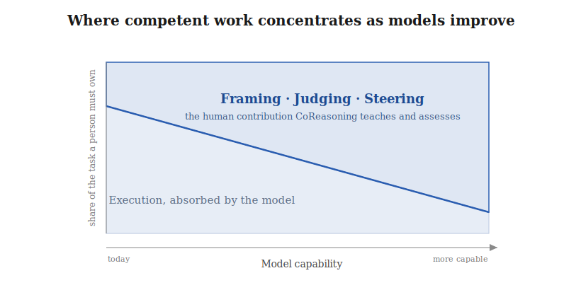
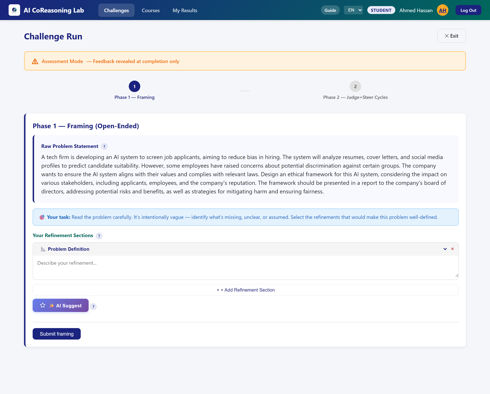
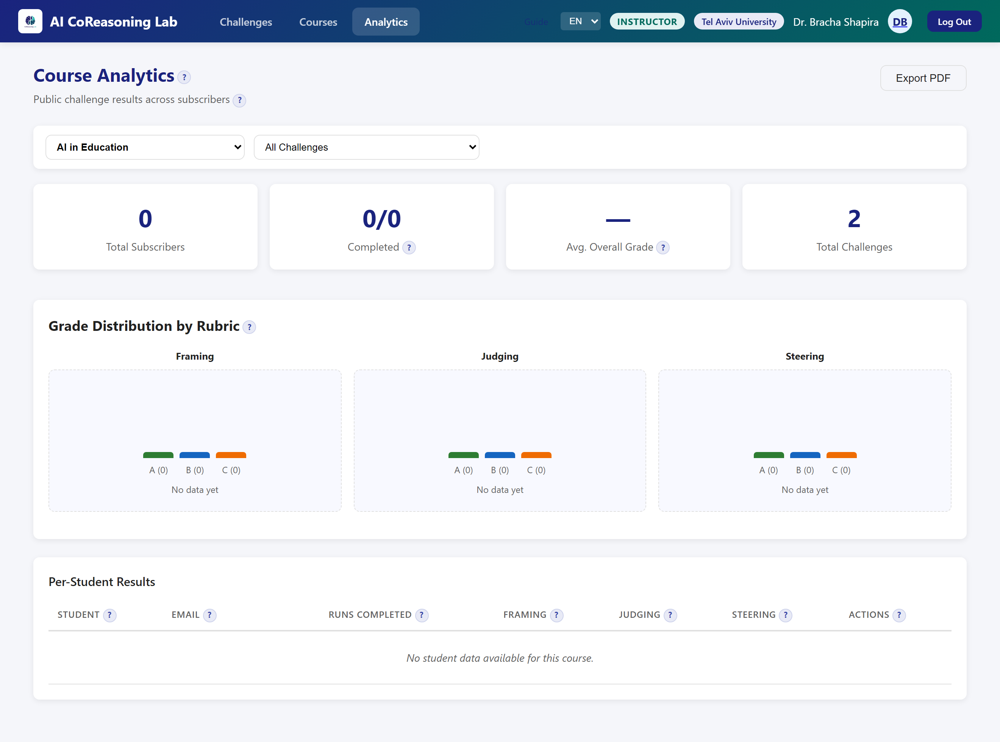
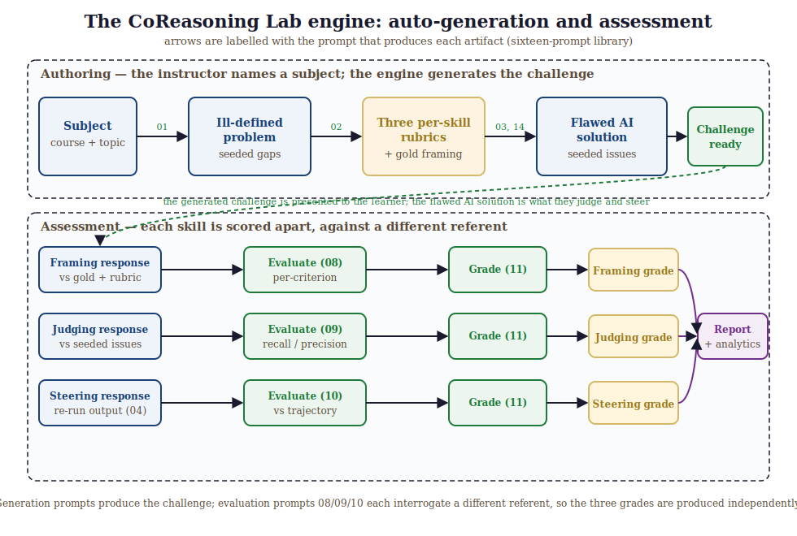

# Framing, Judging, Steering: An Assessable Competency Model for Teaching Students to Reason With Generative AI

**Alexander Apartsin**¹ and **Yehudit Aperstein**²
{: .authors }

¹ Holon Institute of Technology  ·  ² Afeka College of Engineering
{: .affil }

## Abstract

Generative AI makes it trivial to obtain an answer and difficult to obtain understanding, and uncritical
use is increasingly linked to cognitive offloading and weakened critical thinking. This exposes a
mismatch between what education assesses and what students now do: our examinations still measure
*unaided* performance, while the task graduates actually face, in classrooms and workplaces saturated
with capable AI, is to produce good work *with* it, by framing an ill-defined task, judging the output,
and steering the model toward something better. As models absorb more of the execution, this
collaborative work is the part of competent performance that stays with the person, which is precisely
what assessment must now target. This ability to work with AI is neither taught nor
assessed as a competency in its own right; where it is measured at all, it is folded into a single
"prompting" score that cannot diagnose *why* a given learner's AI use succeeds or fails (whether they
specified the task poorly, missed the flaws in the output, or failed to correct them). We treat it
instead as a teachable, assessable competency that can be named, decomposed, and measured. We propose
**CoReasoning**, a competency model that factors productive work with
generative AI into three temporally and cognitively distinct, independently-assessable skills:
**Framing** (transforming an ill-defined problem into a well-specified task before invoking AI),
**Judging** (critically evaluating AI output for errors, gaps, unstated assumptions, and risk),
and **Steering** (iteratively redirecting the AI toward a better solution across cycles). The
central structural claim that distinguishes CoReasoning from existing AI- and prompt-literacy
frameworks is the *separation of the pre-generation skill (Framing) from the post-generation
corrective skill (Steering)*, with Judging as the epistemic gate between them. We ground each skill
in established theory (metacognitive monitoring and control; self-regulated learning; epistemic
vigilance and critical thinking; productive struggle), and state five testable propositions about how
the skills relate. We instantiate the model in **CoReasoning Lab**, an open learning platform
that presents deliberately flawed AI output for students to judge and steer, and scores the three
skills independently. In a feasibility demonstration over *simulated* learners (generated by one model and graded by a
different one to avoid self-grading), the three skills *dissociate*. The result is carried by the two
*blind-graded* skills, Framing and Steering, whose free-text responses the grader scores without
knowing the intended competence: each moves with its own manipulated competence while staying flat in
the others, and the cleanest pair (Framing and Judging) is uncorrelated despite being scored by
entirely separate mechanisms. The same instrument returns *correlated* grades when a single competence
is shared across the three skills, so the separation reflects the learners rather than the scoring
(convergent and discriminant validity). The separation holds under three grader backends spanning two
providers, which also agree on each skill at the per-learner level, and the grader is highly
self-consistent on repeat. The constructs are therefore separable and automatically scoreable; agreement with human raters and learning outcomes are the defined next
steps of the program, for which we release a prepared validation protocol alongside the instrument and
data.

## 1. Introduction

Most AI-in-education tools optimize for the wrong variable. They shorten the path from question to
answer, when the answer was never the point of education. The cognitive work of specifying a problem,
evaluating a candidate solution, and improving it is where learning happens; when that work is
delegated wholesale to a machine, the learner walks away with a correct artifact and an unchanged mind.
The educational opportunity of generative AI is therefore not to deliver answers faster, but to make
the reasoning around them visible, practiced, and assessable.

Recent evidence makes the stakes concrete. Frequent, uncritical AI use correlates with lower
critical-thinking performance, an effect mediated by cognitive offloading and most pronounced in
younger users (Gerlich, 2025). Controlled studies of AI-assisted writing report "metacognitive
laziness," in which learners bypass the self-regulatory processes of diagnosing, evaluating, and
revising (Fan et al., 2025), and neurophysiological work describes an accumulation
of "cognitive debt" when an assistant carries the reasoning load (Kosmyna et al., 2025). At the same
time, field studies of professional AI use show that the benefit of AI is sharply conditional on the
user's skill in directing it: assistance helps inside a model's competence frontier and *harms*
outside it (Dell'Acqua et al., 2023), and the most effective users adopt an iterative, critical
"push-back-and-validate" mode rather than wholesale delegation (Randazzo et al., 2025). Meta-analytic
evidence underscores the stakes: human-AI teams frequently underperform the better of the human or the
AI alone (Vaccaro et al., 2024), which makes the human's skill in directing the system, not mere access
to it, the decisive variable. Direct behavioral evidence sharpens the point: across 16,851 real
student-ChatGPT interactions from a university course (McNichols et al., 2025), students' moves are
dominated by framing-type queries, while explicit verification of the AI's output (about 4% of
interactions) and corrective editing (about 2.5%) are rare, the very under-judging and under-steering a
competency model must target.

These findings share a structure. The difference between productive and counterproductive AI use is
not access to AI; it is a *competency* that some learners exercise and others do not. This echoes the
long-standing distinction between the effects obtained *with* a technology during use and the cognitive
residue left *of* it, which depends on the learner's mindful engagement in the partnership
(Salomon et al., 1991). If that
competency can be named and decomposed, it can be taught and assessed. Current AI-literacy assessment
can often tell us *that* a learner's AI use is unproductive but not *why*: whether they specified the
task badly, failed to detect the flaws in the output, or knew the flaws but could not correct them.
These are different failures with different remedies, and a single "prompting" score conflates them.

This trajectory is not transient, and that is what raises the stakes for assessment. As models absorb
more of the execution, the human contribution does not disappear; it concentrates in the operations a
system cannot perform on its own behalf: choosing which problem is worth solving and specifying it,
judging whether a fluent output is actually right, and redirecting the model when it is not. The field
evidence that AI's value is conditional on the user's skill (Dell'Acqua et al., 2023; Vaccaro et al.,
2024) implies that this conditioning tightens rather than loosens as systems improve, so the durable,
assessable human skill shifts from executing a task to framing, judging, and steering it (Acar, 2023;
Denny et al., 2024) (Figure 1). An assessment that still measures unaided execution therefore measures
a shrinking part of what competent work will require.

*Figure 1 (schematic). As models absorb more of the execution, the part of a task a competent person
must still own shifts from doing the work toward framing, judging, and steering it; the axes are
conceptual, not quantitative. CoReasoning is a decomposition and assessment of that shifting
contribution.*

We propose **CoReasoning**, a competency model that decomposes productive work with generative AI into
three distinct skills, each independently assessable:

- **Framing.** Before invoking the AI, transform an ill-defined problem into a well-specified task:
  surface unstated assumptions, fix constraints and scope, and define what an adequate solution must
  satisfy. Framing is a problem-structuring skill exercised *prior to* generation.
- **Judging.** Given AI output, critically evaluate it as a knowledge claim: detect factual and
  logical errors, missing edge cases, unstated assumptions, and risks, and calibrate how far to rely
  on it. Judging is an evaluative, epistemic skill.
- **Steering.** Across one or more cycles, issue targeted corrective feedback that moves the AI's
  output measurably closer to an adequate solution. Steering is a control skill exercised *after*
  generation, in a loop with Judging.

**Contributions.** This paper makes the following contributions:

1. **A competency model** that decomposes productive work with generative AI into three temporally and
   cognitively distinct, independently-assessable skills (Framing, Judging, and Steering), whose
   defining novelty is the separation of the pre-generation skill (Framing) from the post-generation
   corrective skill (Steering) that prior frameworks fuse.
2. **A theoretical grounding** that maps each skill to established theory (metacognitive monitoring and
   control, self-regulated learning, epistemic vigilance and critical thinking, productive struggle)
   under a single unifying monitor-control architecture, so the decomposition is principled rather
   than ad hoc.
3. **Five testable propositions** about how the skills relate (framing gates the loop; judging gates
   steering; the skills dissociate; judging transfers less than framing; the model inverts cognitive
   offloading), which is what turns a taxonomy into a conceptual contribution that proposes new
   relationships among constructs (Gilson & Goldberg, 2015; Jaakkola, 2020).
4. **A precise novelty positioning** against the nearest prior frameworks (AI-fluency, metacognitive-
   demands, prompt-literacy, and AI-literacy models), stating exactly what is and is not new.
5. **A proof-of-concept instrument and feasibility demonstration** showing that the three skills can be
   scored automatically, with a multitrait-multimethod validity analysis (three grader backends across
   two vendors; shared- versus independent-competence populations) giving convergent and discriminant
   evidence that the skills are separately measurable, not one relabeled "prompting" skill.
6. **A reproducible, released artifact** (the assessment instrument and the experiment data) together
   with a fully prepared human-rater validation protocol for the community to run.

The empirical material is a feasibility demonstration of *construct separability and measurability*;
the efficacy study that tests learning outcomes is the next stage of the program (Section 10).

## 2. The problem with current AI-literacy assessment

Existing instruments for assessing how students work with AI are not wrong so much as
under-resolved. Knowledge-oriented frameworks such as Long and Magerko (2020) and the UNESCO (2024)
student competency framework define AI literacy chiefly as *understanding AI systems*: what AI is,
what it can and cannot do, how it works, and how it should be governed. These are necessary, but they
say little about the *performance* of working with a model on a task. Prompt-literacy and
generative-AI-literacy models (Lo, 2023; Annapureddy et al., 2024) move closer to performance, but
they bundle task specification and iterative refinement into a single "prompting" competency and treat
evaluation of the output as a downstream check rather than a co-equal skill.

The cost of this coarse resolution is diagnostic. When a learner's AI use produces a poor result, a
single prompting score cannot tell an instructor *which* cognitive operation failed: did the learner
specify the task badly, so that the model solved the wrong problem; did they fail to detect the flaws
in an otherwise plausible output; or did they see the flaws but issue corrections too vague to fix
them? These are three different failures with three different remedies (teaching problem
specification, teaching critical evaluation, and teaching corrective communication), and an instrument
that cannot separate them cannot guide instruction. Integrative reviews of AI literacy after
generative AI confirm that the field still lacks a scheme isolating distinct, independently-assessable
reasoning competencies (Gu & Ericson, 2025), even as syntheses document generative AI's mixed effects
on critical and creative thinking (Li et al., 2026). A diagnostic competency model must therefore
decompose the human-AI loop into the distinct operations that can each break, and must show that those
operations are in fact separable in learners. That is the gap CoReasoning addresses.

## 3. The CoReasoning framework

### 3.1 A monitor-control architecture with an upstream task-definition

The three skills are not an arbitrary list; they instantiate a well-understood cognitive
architecture. Nelson and Narens (1990) describe metacognition as a two-level system: an object level
(cognition itself) and a meta level (a dynamic model of the object level), linked by **monitoring**
(information flowing from object to meta) and **control** (commands flowing from meta to object).
In CoReasoning, the learner's meta level supervises an object level that is *external*, the AI's
generative process, rather than the learner's own cognition. This is a deliberate extension of the
Nelson-Narens architecture from intrapersonal monitoring to what we term *exo-directed* monitoring and
control, and it is the framework's central theoretical move: the same metacognitive machinery is turned
outward onto a fallible cognitive artifact. This extension is non-trivial. Exo-directed monitoring adds
an epistemic-vigilance burden that self-monitoring does not have: the learner must judge the reliability
of a source whose competence differs from, and is hidden from, their own. This is exactly why Judging is
bounded by domain knowledge (Proposition P4). With that point made, the mapping is direct:

- **Judging is monitoring.** The learner compares AI output against an internal model of an adequate
  solution and registers discrepancies.
- **Steering is control.** The learner acts on the monitoring signal, issuing commands that change
  the object-level process.
- **Framing is task definition.** Before monitoring can occur, the learner must establish the
  *standards* against which output is judged. In the COPES model of self-regulated learning (Winne &
  Hadwin, 1998), task definition is the explicit first phase, and products are evaluated against
  internally held standards; mismatch triggers reprocessing. Framing is that task-definition phase
  applied to a human-AI loop: it sets the referent that makes Judging and Steering well-posed.

The Judge→Steer cycle is therefore a monitor→control loop seeded by a task definition. This is the
structural spine of the framework and the reason the three skills cohere rather than coexist by stipulation
(Figure 2).

*Figure 2. The CoReasoning loop. An upstream task definition (Framing, a self-regulated-learning
forethought activity) sets the standards against which a metacognitive monitor-control cycle (Judging
then Steering) supervises a fallible AI at the object level. Judging is the monitor's read-out;
Steering is the controller's write.*

### 3.2 The temporal-separation claim (what makes the decomposition non-obvious)

Existing frameworks treat "use the AI well" as one skill or, at most, pair "prompt" with "evaluate."
CoReasoning's distinctive move is to separate two operations that prior models fuse: the
*pre-generation* skill of structuring the task (Framing) and the *post-generation* skill of correcting
the output (Steering). These are different cognitive acts at different points in time, with different
error modes and different instructional remedies. A learner can frame impeccably and steer poorly
(detect a flaw but issue a vague correction), or steer fluently atop a malformed task (drive the AI
energetically toward the wrong target). Collapsing both into "prompting" hides exactly the
distinctions an educator needs.

### 3.3 Distinguishing Judging from Steering

Because Judging and Steering both occur after generation and in a tight loop, their boundary needs
stating precisely. **Judging is assessment; Steering is action.** Judging produces a *representation
of what is wrong* with the current output, an internal or articulated list of detected flaws, gaps,
and risks, and a calibrated sense of how much to trust the output. It is evaluative and its output is
a diagnosis. Steering consumes that diagnosis and produces a *corrective instruction* aimed at
changing the next output: it is generative and directive, and its quality depends on prioritization
(addressing the most critical flaw first), specificity (an actionable command rather than "improve
this"), and effectiveness (whether the output actually converges). In the monitor-control terms of
Section 3.1, Judging is the monitor's *read-out* and Steering is the controller's *write*. The two
dissociate because the competencies differ: a learner may diagnose accurately yet communicate the fix
poorly (good Judging, weak Steering), or issue fluent, confident commands that target the wrong thing
because the diagnosis was wrong (weak Judging propagating into misdirected Steering, the failure mode
Proposition P2 predicts). This last point also reconciles an apparent tension: P2 (Judging bounds
Steering) implies the two grades will be *positively correlated* in the aggregate, while P3 claims they
*dissociate*. Both hold. P2 is a ceiling relation (Steering cannot exceed the quality its Judging
permits), which induces correlation without identity; P3 is the claim that the off-diagonal is well
below the reliability ceiling, so the skills are not interchangeable. We therefore test dissociation
pairwise and report whether each skill's grade responds to its own manipulated competence while
remaining comparatively flat in the others, rather than relying on a single global factor model.

## 4. Theoretical grounding

Each skill is anchored in established theory, and the anchors are mutually consistent because they
share the metacognitive backbone of Section 3.1.

**Framing** is the task-definition phase of self-regulated learning. In the COPES model (Winne &
Hadwin, 1998), self-regulated work begins by constructing a definition of the task and the standards a
product must satisfy; Zimmerman's (2000) forethought phase similarly precedes performance with goal
setting and strategic planning. Framing applies this phase to a human-AI loop: the learner converts an
ill-defined situation into a specified task with explicit constraints and success criteria. In Bloom's
revised taxonomy (Anderson & Krathwohl, 2001), specifying an original task is a Create-level activity,
and the competence to know what makes a task tractable for a given tool is metacognitive task
knowledge (Flavell, 1979).

**Judging** is metacognitive monitoring (Nelson & Narens, 1990) directed at an external generative
source. Its content is the evaluative core of critical thinking, the Delphi-consensus skills of
analysis and evaluation (Facione, 1990) and the Paul and Elder (2006) intellectual standards, which supply a
ready vocabulary for assessing reasoning. Because the object being judged is a *communicated knowledge
claim* from a fluent but fallible source, the most precise anchor is epistemic vigilance (Sperber et
al., 2010), which pairs source monitoring (is this source trustworthy?) with content evaluation (is
this internally and externally coherent?). Barzilai and Chinn's (2018) account of apt epistemic
performance adds the criteria-for-good-knowledge dimension that a learner must hold to judge well, and
the human-automation literature supplies the calibration target: reliance matched to actual
reliability (Lee & See, 2004), the failure of which is the over-reliance documented in AI-assisted
decision-making (Bansal et al., 2021; Buçinca et al., 2021) and the broader automation-complacency it
extends (Parasuraman & Manzey, 2010). That Judging is a trainable skill rather
than an automatic byproduct of competence is underscored by recent evidence that metacognitive
monitoring can decouple from performance in human-AI reasoning (Fernandes et al., 2024), and by recent
work on whether learners can evaluate AI output quality as experts do (Nazaretsky et al., 2025).

**Steering** is metacognitive control (Nelson & Narens, 1990): acting on the monitoring signal to
change the object-level process. Pedagogically it inverts cognitive-apprenticeship coaching and
scaffolding (Collins, Brown & Newman, 1989): the learner, not the master, supplies the corrective
guidance. Its quality depends on the learner monitoring the work against held standards (Sadler, 1989),
and is well described by feed-forward, the "where to next" component of effective feedback
(Hattie & Timperley, 2007).

**The loop and its positioning.** The Judge-Steer cycle is designed to push learners into the
Interactive mode of the ICAP framework (Chi & Wylie, 2014), in which knowledge is co-constructed
through dialogue rather than passively received, the mode ICAP associates with the greatest learning.
The framework casts the AI as a mediating cultural tool that extends the learner's zone of proximal
development (Vygotsky, 1978): the learner accomplishes with the model what they could not alone, while
internalizing the Framing, Judging, and Steering moves for eventual independent use.

**The pedagogical stance.** CoReasoning's rejection of speed-to-answer rests on the literature of
productive struggle and desirable difficulties (Bjork & Bjork, 2011; Kapur, 2008): conditions that
slow performance but deepen learning. The friction of specifying, evaluating, and correcting is not an
obstacle to be engineered away but the very locus of learning, which is why the instructional design
deliberately presents imperfect output for the learner to improve rather than a polished answer to
accept.

## 5. Propositions

- **P1 (Framing gates the loop).** Framing causally precedes and bounds Judging and Steering;
  framing failures are not recoverable by downstream steering, because a malformed task gives the
  monitor no stable referent.
- **P2 (Judging gates Steering).** Steering quality is upper-bounded by Judging quality: undetected
  flaws cannot be corrected, and high steering effort over poor judging yields confident misdirection
  (the over-reliance failure mode).
- **P3 (Dissociation).** The three skills are separable competencies; proficiency in one does not
  imply proficiency in another. This is the central empirically-testable claim, and it establishes
  that the three skills are genuinely distinct rather than a relabeling of "prompting."
- **P4 (Asymmetric transfer).** Judging is bounded by domain knowledge (the calibration trap) and
  therefore transfers across domains less readily than the more structural skill of Framing.
- **P5 (Inverse of offloading).** Each skill re-inserts a self-regulatory operation that cognitive
  offloading short-circuits; the framework offloads *execution* while retaining *cognition*.

These propositions differ in how far the present work tests them. The feasibility demonstration
(Section 8) directly supports **P3** (the three skills dissociate) and bears partly on **P2** (the
steering own-effect is bounded in a way consistent with judging gating steering). **P1**, **P4**, and
**P5** are stated here as falsifiable hypotheses for the validation and classroom agenda (Section 10),
not as claims the demo establishes. Each names a concrete test: P1 fails if a strong steering
intervention recovers grades after a deliberately malformed framing; P4 fails if Judging transfers
across domains as readily as Framing; P5 fails if exercising the loop does not reduce the offloading
signatures (for example, reduced post-task recall) documented in the cognitive-debt literature.

## 6. Relation to prior frameworks

The constructs that compose CoReasoning are not individually new; what is new is their separation into
three parallel, independently-assessable competencies anchored in a monitor-control architecture. We
make the boundary explicit by confronting the nearest priors directly.

**AI-fluency frameworks.** The closest practitioner framework is the 4D model of AI fluency (Dakan &
Feller, 2025): Delegation, Description, Discernment, Diligence. Its Discernment maps cleanly onto
Judging, but its Description bundles two operations we deliberately separate: crafting the initial
specification and conducting the iterative back-and-forth. CoReasoning's contention is that these are
distinct skills at distinct times, the pre-generation act of Framing and the post-generation act of
Steering, with different error modes (a malformed task versus a mis-targeted correction) and different
instructional remedies. CoReasoning also derives its skills from learning theory and an assessment
rationale rather than from a fluency heuristic, and so yields rubrics and dissociation predictions
that a checklist does not.

**Metacognitive analyses of generative AI.** The strongest construct-level neighbour is Tankelevitch
et al. (2024), who analyse generative-AI use through the lens of metacognitive demands, naming
prompting, output evaluation, and workflow iteration as sites of metacognitive monitoring and control.
We share the metacognitive foundation but differ in goal: their contribution is a demands analysis (a
cognitive-load lens that explains why GenAI is hard to use well), whereas ours is an assessable
competency model with explicit rubrics, propositions, and feasibility evidence that the components
dissociate. The two are complementary: their analysis motivates why each of our skills is cognitively
demanding; our framework makes each one measurable.

**Prompt-literacy frameworks.** Prompt-literacy models such as CLEAR (Lo, 2023) and the broader
prompt-literacy literature define competence as constructing a precise prompt and iteratively refining
it. The most developed recent decomposition, an operationalization of prompt literacy into formulate,
interpret, and refine sub-practices (Tour & Zadorozhnyy, 2025), is the closest competitor to our
triad; but it bundles task specification and iterative refinement under "prompting" and does not treat
the sub-practices as separately graded, dissociable competencies. This fusion of Framing and Steering
into a single "prompting" skill is exactly the conflation CoReasoning rejects. Treating them
separately is not a cosmetic relabeling: it predicts, and our feasibility demonstration supports, that
a simulated learner's model-assigned Framing and Steering grades can diverge.

**Metric frameworks for human-AI cognition.** A distinct 2026 line proposes named multi-metric schemes
for working with AI, for instance a cognitive-amplification-versus-delegation framework with dependency
and drift metrics (Di Santi, 2026). These measure the *sustainability* of reliance rather than
teachable framing, judging, and steering competencies, and so are complementary to, not competitive
with, an assessable-skill decomposition.

**Knowledge-oriented AI-literacy frameworks.** Field-defining competency sets such as Long & Magerko
(2020) and the UNESCO (2024) student framework define AI literacy primarily as understanding AI
systems, their capabilities, limits, and ethics, rather than as executing tasks within a human-AI
loop. They contain no Framing or Steering construct and only a diffuse notion of critical evaluation
that partly overlaps Judging. CoReasoning is orthogonal: it specifies the task-execution competencies
these frameworks leave implicit.

**Empirical accounts of AI-use modes.** Field studies describe how skilled users actually work with AI:
the "Cyborg" mode of continuous push-back-and-validate (Randazzo et al., 2025) and the sharp
skill-dependence of AI's value at the competence frontier (Dell'Acqua et al., 2023). These describe the
behaviour; CoReasoning supplies the assessable skill decomposition that underlies it.

Table 1 makes the boundary explicit by mapping each nearest prior framework's constructs onto
Framing, Judging, and Steering. The recurring pattern is that prior frameworks either (i) omit a
construct, or (ii) *fuse* Framing and Steering into one "prompting/iteration" skill.

**Table 1. Where prior frameworks place the three CoReasoning skills.**

| Prior framework | Framing (pre-generation) | Judging | Steering (post-generation) |
|---|---|---|---|
| 4D AI Fluency (Dakan & Feller, 2025) | Delegation + part of Description | Discernment | *fused into* Description |
| Metacognitive demands (Tankelevitch et al., 2024) | "prompting" (as a demand, not a skill) | "evaluating outputs" | "workflow iteration" |
| Prompt literacy / CLEAR (Lo, 2023) | *fused into* "prompting" | weakly present | *fused into* "iterative refinement" |
| AI literacy (Long & Magerko, 2020; UNESCO, 2024) | absent | diffuse "critical evaluation" | absent |
| Cyborg/Centaur modes (Randazzo et al., 2025) | "directed" mode (described, not assessed) | "push back / validate" | "continuous dialogue" |

No prior column cleanly separates the pre-generation and post-generation skills *and* treats all
three as independently scored competencies. That conjunction is the contribution.

**Validated GenAI-competency instruments.** A parallel line of work builds psychometric instruments
for AI and generative-AI competence, including validated scales such as GenAIComp (Lee et al., 2025;
with factors derived from digital-competence frameworks) and assessment tests such as GLAT
(Jin et al., 2024). These establish that GenAI competence can be measured, but their factor structures
are literacy-oriented (information literacy, ethics, content creation) and do not isolate a Framing,
Judging, or Steering construct. The work closest to ours pairs AI-collaboration literacy with
metacognition (Sidra & Mason, 2025) and includes an AI-evaluation
sub-construct that overlaps Judging; we differ in separating the pre-generation and post-generation
control skills and in demonstrating their dissociation rather than positing correlated factors.
CoReasoning is complementary to this measurement program: it supplies the specific, theory-derived
decomposition that a future validated instrument could operationalize. Rubric-based LLM grading studies
report high agreement with human raters (intraclass correlation up to 0.97) yet systematic divergence on
subjective criteria (Yavuz et al., 2025); the multitrait-multimethod design we use across three grader
backends (Section 8) treats that grader-method variance as a measured term rather than a confound.

**Problem formulation as the AI-era skill.** A prominent strand argues that, as models absorb
execution, the durable human skill shifts from prompt crafting to *problem formulation*, identifying,
analyzing, and delineating the problem worth solving (Acar, 2023). This is precisely our Framing
construct, and classroom work has begun to assess it directly, for example through "prompt problems"
that require students to specify and evaluate rather than only prompt (Denny et al., 2024), and
through instruments that treat question formulation (Kim et al., 2025) and problem decomposition
(Srinath et al., 2025) as independently measurable, trainable skills in generative-AI settings. That
Framing is a distinct competency is further supported by the older problem-finding literature, which
established problem finding as empirically separable from problem solving (Runco & Chand, 1995). We
build on this strand by placing Framing in a measured loop with Judging and Steering.

**Evaluative judgement and named-competency frameworks.** The capacity to discern quality, *evaluative
judgement*, has been argued to be the core human capability for the generative-AI era (Bearman et al.,
2024), and students are observed to make continuous in-the-loop accept-and-reject judgements while
working with AI on assessment tasks (Walton et al., 2025). Our Judging skill operationalizes evaluative
judgement specifically for AI output; CoReasoning then departs from a unified-judgement account by
separating it from the generative acts of Framing and Steering, treating evaluation as one of three
independently-measurable skills rather than a single overarching disposition. Two findings reinforce
that Judging is a separable, demanding construct: critical evaluation is the single highest-load
activity in AI-assisted writing (Yao & Fan, 2025), and users default to uncritically accepting AI
output absent intervention (Wingerter et al., 2025). Among named competency frameworks, the AI Quotient
enumerates eight broad collaboration dimensions (Ganuthula & Balaraman, 2025); CoReasoning instead
collapses to three minimal, independently-assessable skills and, crucially, splits the single
prompt-engineering dimension that such frameworks leave fused into a pre-generation Framing skill and a
post-generation Steering skill. Frameworks that partition coursework by assessment mode rather than by
cognitive skill (Elshall & Badir, 2025) are orthogonal and complementary.

**One-line novelty.** CoReasoning is, to our knowledge, the first theoretically-grounded decomposition
of productive generative-AI use into three independently-assessable competencies that separates
pre-generation Framing from post-generation Steering, with feasibility evidence that the three skills
dissociate. The defensible claim is not that any single skill is new, but that the *separation* is
both theoretically motivated (monitor-control plus an upstream task definition) and empirically
consequential (the skills can be measured apart).

## 7. The CoReasoning Lab system

The framework is instantiated in *CoReasoning Lab*, a runnable open-source web platform, which we
describe here so that the abstract skills map onto a concrete learner experience. The platform is a
Node/Express application with role-based access (student, instructor, administrator), a challenge
database, practice and assessment modes, multiple-choice and open-ended response formats per phase, and
a five-language content library (English, Hebrew, German, Spanish, French). Its full source, the web
application, the database schema, the content library, and the *scoring engine* of sixteen prompts
(Section 7.1), is released, alongside a pedagogical-foundations document mapping the design to learning
theory. Figures A1 and A2 are screenshots of the running platform. All challenges evaluated in this paper are
English-language (Section 11), and the quantitative results come from the scoring engine over controlled
inputs rather than from production usage logs.

Because challenge generation, rubric generation, and scoring are themselves prompt-defined, the engine
extends to a new subject, language, or grader backend by substitution rather than redesign: the
feasibility demonstration exercises it unchanged across ten subjects (Section 8) and two grader models,
and the released artifact lets others add their own. The platform is therefore **domain-general**: it is
not a computing-education tool but a generic instrument for any discipline in which a learner must
specify an ill-defined task, judge a fallible solution, and steer it toward a better one. The released
content already spans **twelve disciplines** across STEM, the social sciences, the humanities, law, and
professional and education fields, from algorithms and classical mechanics to constitutional law,
applied ethics, and instructional design (Appendix C). An educator in any of these fields authors a
challenge by naming a subject; the system generates the ill-defined problem, the three per-skill
rubrics, and the seeded-flaw solution. The monitor-control scaffold is likewise open to
additional skills where a setting calls for them; the three are a deliberately small decomposition that
separates pre-generation, evaluative, and post-generation control. The released instrument is therefore
usable as a starting point for others to extend, not only to reproduce.

**Authoring flow (instructor).** An instructor defines a challenge by choosing a course and subject
path; the system then generates the ill-defined problem, the three per-skill rubrics, the gold-standard
framing, and the seeded-flaw solution that the learner will critique (Section 7.1). Challenges are
organized into courses and can be assigned to cohorts.

**Learner flow (student).** From a dashboard of assigned challenges (Figure A2), a student enters a
challenge run that walks through the framework's two phases (Figure A1):

1. *Phase 1: Framing.* The student is shown the raw, ill-defined problem and adds refinement sections
   (assumptions, constraints, clarifications, success metrics) or selects refinements in
   multiple-choice mode, then submits. The platform returns rubric-driven Framing feedback and a grade.
2. *AI generation.* The system produces a plausible but deliberately flawed solution to the framed task.
3. *Phase 2: Judge/Steer cycles.* In each cycle the student first **judges** the current output
   (flagging issues it contains) and then **steers** the AI (issuing correction commands); the AI
   returns an updated output. The student repeats this up to a configured maximum number of cycles and
   marks the task complete when satisfied.
4. *Per-skill feedback and grades.* Framing, Judging, and Steering are scored separately, each with its
   own rubric-driven feedback, and surfaced in a per-challenge report and in longitudinal student
   analytics (Figure A2) that track the three skills independently over time.

This separation in the interface, distinct phases, distinct feedback channels, and distinct grade
columns, is the framework's central claim made operational: a learner sees, and is scored on, three
different things they did, not one undifferentiated "AI use." The remainder of this section describes
the instrument that produces those scores.

## 7.1 Operationalization: a proof-of-concept instrument

To show that the three constructs are not only conceptually distinct but practically measurable, we
describe a working instrument that scores each skill from a learner's transcript. The instrument is a
pipeline of large-language-model prompts; we use it here as an existence proof that automated,
rubric-driven scoring of Framing, Judging, and Steering is feasible, not as a validated assessment.

**Challenge construction.** Each challenge begins with a deliberately ill-defined problem generated to
contain two or three unstated gaps, recorded internally but never shown. A per-challenge set of three
rubrics, one each for Framing, Judging, and Steering, is generated for the subject area, each with
three to five measurable criteria and explicit excellent and poor indicators. A gold-standard "best
framing" is generated as an internal reference. The design instantiates an inverted cognitive
apprenticeship: rather than observing an expert, the learner is given a fallible artifact to repair.
This connects the instrument to the instructional literature on learning from errors and erroneous
examples, in which studying and correcting flawed solutions improves error detection and conceptual
understanding relative to studying only correct ones (Große & Renkl, 2007; Durkin & Rittle-Johnson,
2012); CoReasoning generalizes that paradigm from static worked examples to an interactive,
learner-driven repair loop over AI output.

**The deliberately-imperfect output.** After the learner frames the task, the model produces a
plausible, professional-looking solution that is required to embed two to four non-trivial issues,
wrong-but-reasonable assumptions, missing edge cases, or subtle logical errors, each recorded
internally with a severity label and none flagged to the learner. Across steering cycles, updates
address the learner's commands but may introduce new minor issues, so that difficulty adapts to the
quality of steering rather than collapsing to a perfect answer.

**Scoring.** Each skill is scored in two stages. A skill-specific evaluator assesses the learner's
response against the (internal) rubric and produces per-criterion ratings on a three-point scale; a
generic grading stage then aggregates those ratings into a final grade, weighting critical criteria
more heavily rather than averaging. Crucially, the three evaluators differ in what they compare
against: Framing is evaluated against the gold framing and the rubric; Judging is evaluated against the
seeded ground-truth issues, yielding a recall/precision signal (issues correctly identified, missed,
and falsely flagged); and Steering is evaluated against the trajectory of the output across cycles,
rewarding corrections that demonstrably move the solution toward correctness. This is why the skills
are measured *apart*: each evaluator interrogates a different referent.

The instrument used in this paper is the scoring engine of the CoReasoning Lab platform, a library
of sixteen prompts spanning challenge construction, AI generation, and evaluation (Figure A3 traces the full
generation-and-assessment pipeline). The released library
carries the platform's evaluation logic verbatim, the same rubrics, criteria, and system prompts as the
deployed application; the only adaptation is that JSON output formatting is supplied by the research
harness rather than embedded in each prompt. The surrounding harness (simulated-learner generation, the
crossed factorial, and the analysis) is research orchestration around that fixed evaluation logic, not a
reimplementation of it, so the measurements characterize the instrument itself. Scoring a single
learner exercises the relevant subset, the three skill evaluators and the generic grader, over
controlled inputs, so that the measurements are reproducible and the ground truth is known. A
scope note: the grader is a language model, so the results below characterize the *internal* behavior
of the instrument (whether it separates controlled competence levels and dissociates the skills);
agreement with human experts is the separate validity question the prepared study in Section 10
addresses.

## 8. Feasibility demonstration

We exercise the instrument over controlled inputs to test three feasibility claims: that it
*discriminates* competence, that the three skills *dissociate* (Proposition P3), and that the grader is
*self-consistent* enough to report. The "learners" are simulated personas of controlled per-skill
competence, generated by one model (gpt-4o-mini) and graded by a *different* model (gpt-4o), so that no
model grades its own output. These claims concern the instrument; the agreement study with human expert
graders is prepared and is the next stage (Section 10).

**Design.** We use a crossed factorial: each of the three skills is independently set to a strong or
weak competence level, giving $2^3 = 8$ profiles, crossed with ten challenges across ten distinct
subjects (algorithms, microeconomics, machine learning, databases, statistics, operating systems,
calculus, organic chemistry, linguistics, and corporate finance), for 80 simulated learners. Framing
and Steering responses are generated by the competence-conditioned learner model; Judging is operationalized by a competence-conditioned
selection over the challenge's ground-truth seeded issues (a strong judge flags all real issues and no
false ones; a weak judge flags few real issues and some false ones). These seeded issues and the
distractors are themselves machine-generated and not yet human-verified, so Judging's by-construction
own-effect is explicitly contingent on that ground truth being correct. Because the manipulation is per skill,
the design can separate whether each grade tracks its *own* skill's competence (discrimination) from
whether it is *insensitive* to the other skills' competence (dissociation).

**Discrimination.** Grades move monotonically with competence: the all-weak profile averages C on every
skill, the all-strong profile averages between B and A, and each skill's grade rises when that skill is
set to strong. The judging signal is mechanistically transparent: a strong judge flags all of the seeded
issues with no false alarms and is graded A; a weak judge flags none and raises false issues and is
graded C.

**Dissociation (the central result).** Table 2 reports, for each graded skill, the change in its mean
grade (on a 3-point scale, A=3..C=1) when each skill in turn is moved from weak to strong. The result
that carries the claim is the two *blind-graded* skills, Framing and Steering, whose free-text responses
the grader scores without knowing the intended competence: each shows a clear positive own-effect
(**+0.62** and **+0.43**) with near-zero cross-effects, so a simulated learner's two free-text grades
move independently. Judging's own-effect (**+2.00**) is large but *fixed by construction*: its
competence is operationalized by a controlled selection over the challenge's seeded issues, and those
seeded issues are themselves machine-generated and not yet human-verified (Section 11). We therefore
read Judging's clean diagonal as a controlled check that the grader correctly rewards recall and
precision, not as independent evidence that the skills separate. The off-diagonal (cross-skill) effects
average +0.01 across the matrix, so each grade responds to its own skill and is essentially flat in the
others (Figure 3).

**Table 2. Effect on each skill's grade of manipulating each skill's competence (grade Δ, strong − weak; N=80).**

| grade of ↓ \ manipulated → | Framing | Judging | Steering |
|---|---|---|---|
| **Framing** | **+0.62** | −0.02 | −0.07 |
| **Judging** | +0.00 | **+2.00** | +0.00 |
| **Steering** | −0.12 | +0.27 | **+0.43** |

The diagonal (own-skill) effects are statistically reliable: bootstrap 95% confidence intervals
(2,000 resamples) exclude zero for Framing (+0.62, CI [+0.46, +0.77]) and Steering (+0.43, CI
[+0.20, +0.65]); Judging is deterministic by construction (+2.00). The same separation appears in the
inter-skill grade correlations across the 80 learners: Framing-Judging $\rho = -0.03$ ($p = 0.82$) and
Framing-Steering $\rho = -0.12$ ($p = 0.29$) are both non-significant, while Judging-Steering
$\rho = +0.25$ ($p = 0.02$) is positive and significant. The **Framing-Judging** pair is the decisive
demonstration: these two skills are scored by entirely separate mechanisms (free-text framing
evaluation versus issue-selection judging) yet their grades are uncorrelated, which a single
general-ability account cannot produce. The Judging-Steering correlation behaves exactly as Proposition
P2 predicts, the expected ceiling relation in which judging gates steering, and so is consistent with,
rather than evidence against, separability. With only three indicators a formal factor model is
under-identified, so we rest the separability evidence on the manipulation-based effect matrix and the
inter-skill correlations rather than on a confirmatory dimensionality test.

**Convergent and discriminant validity (a multitrait-multimethod view).** The result so far is a
*discriminant*-validity finding: three skills (traits) separate. Construct validity also requires the
complementary *convergent* property, that the same skill measured by different methods agrees, and that
the instrument reports correlation when the underlying competence really is shared (Campbell & Fiske,
1959). Two analyses supply it. First, treating the three grader backends as independent methods, the
same skill graded by gpt-4o, gpt-4o-mini, and the independent-vendor llama-3.3-70b agrees at the
per-learner level for the two skills with the widest grade range (mean pairwise rank correlation +0.57
for Framing and +0.67 for Judging across the 40 shared transcripts), while *different* skills stay near
zero, the convergent-high / discriminant-low pattern a valid measure should show; Steering's narrower
range under the P2 ceiling yields a lower cross-method correlation (+0.21), a restriction of variance
rather than a separate construct. Laid out as the full multitrait-multimethod matrix, the convergent
correlations (same skill across graders, mean +0.49) exceed both the heterotrait-monomethod correlations
(different skills within one grader, mean +0.08) and the heterotrait-heteromethod correlations (mean
+0.06); no grader shows halo (within-grader cross-skill mean $|\rho|$ of 0.13, 0.18, 0.13 for the three
backends), so all three Campbell-Fiske criteria hold. Second, the instrument is faithful to the population's dependence
structure: on learners whose three competences are set *independently* (the full crossed design) the
inter-skill grade correlations are near zero (mean $|\rho| = 0.13$; Framing-Judging $\rho = -0.03$),
whereas on the 20 learners whose three competences are all set strong or all set weak (a single shared
ability level) the same instrument returns *positive* correlations (mean $\rho = +0.41$;
Framing-Judging $\rho = +0.52$). The instrument therefore does not
manufacture dissociation: it recovers independence when the competences are independent and correlation
when they are shared, which is what licenses reading the crossed-design separation as a property of the
skills rather than of the scoring (Table 3).

**Table 3. Multitrait-multimethod validity.** Panel A: convergent agreement of the same skill across
the three grader backends (mean pairwise per-learner rank correlation on the 40 shared transcripts).
Panel B: inter-skill grade correlation by population, showing the instrument recovers the population's
dependence structure (discriminant on the full crossed design, convergent on the n=20 all-strong and
all-weak learners whose three competences share one level).

| Panel A: cross-grader convergent ($\rho$, 3 backends) | Framing | Judging | Steering |
|---|---|---|---|
| same skill across gpt-4o, gpt-4o-mini, llama-3.3-70b | **+0.57** | **+0.67** | +0.21 |

| Panel B: inter-skill $\rho$ by population | F-J | F-S | J-S | summary |
|---|---|---|---|---|
| independent (crossed) competences | −0.03 | −0.12 | +0.25 | mean $\lvert\rho\rvert$ = 0.13 |
| shared single-ability level | **+0.52** | +0.14 | **+0.56** | mean $\rho$ = +0.41 |

The own-skill effects are directionally consistent across subjects: broken down by the ten subject
areas (eight learners each), Framing and Steering each show a positive own-competence effect in nine of
ten subjects, with the two exceptions (Framing in statistics, Steering in microeconomics) reflecting
the small per-subject sample rather than a sign reversal; Judging is fixed by construction in every
subject. The own-competence effect is therefore not driven by any single domain; the pooled own-effects
and their confidence intervals above carry the estimate, and the per-subject pattern shows it holds
broadly across the curriculum. The designed-contrast personas make the separation concrete (Figure 4, which plots five
profiles). Three are especially telling: a *weak-framer / strong-judge* learner scores Framing C but
Judging A; a *strong-framer / weak-judge* learner inverts this to Framing B, Judging C; and a
*weak / weak / strong-steerer* elevates only Steering. A single underlying "AI-use
ability" cannot produce these crossed profiles. Converging evidence comes from outside our synthetic
setting. In an intervention study, students' *behavioral* regulation of LLM use (reformulating queries,
checking correctness) predicts effective use, whereas self-rated AI expertise does not (Clerc et al.,
2026). The skill of working with AI is thus distinct from a general, self-assessed competence.

*Figure 3. Effect of manipulating each skill's competence (columns) on each skill's grade (rows). Each
cell is the grade change (strong minus weak) on the 3-point scale (A=3, B=2, C=1); warmer cells are
larger positive effects. The diagonal (own-skill effect) dominates; off-diagonal (cross-skill) effects
are near zero.*

*Figure 4. Mean per-skill grade for five competence profiles. Judging reaches A only when judging is
strong, regardless of framing or steering; each skill responds to its own competence.*

**Robustness and ablations.** Three checks, reported in full in Appendix B, support the result: the grader is **92% self-consistent** on repeat (a precision check, not accuracy against humans); the dissociation replicates across three grader backends spanning two providers (gpt-4o, gpt-4o-mini, and Meta's llama-3.3-70b; diagonal-to-off-diagonal ratio 39), so it does not hinge on one model snapshot; and a ground-truth ablation shows Framing and Steering are scored by rubric-guided model judgment while Judging, as instrumented, tracks the seeded answer key, which locates the Judging score to settings with known ground truth (Section 10 specifies the open-ended variant).

**Scope.** These results establish feasibility. (i) Judging's clean diagonal (+2.00, zero cross-effects)
is a controlled check by design: its competence is set by a controlled selection over the seeded
issues, so the diagonal confirms that the grader correctly rewards recall and precision, and the
independent separation evidence is carried by the free-text, blind-graded skills, Framing and Steering,
whose positive own-effects (+0.62, +0.43) with near-zero cross-effects drive the result. (ii) The
dissociation replicates across grader backends spanning two providers (Appendix B); agreement with
human experts is the validity step the prepared study in Section 10 supplies.
(iii) With three constructs the separability evidence rests on the manipulation-based effect matrix and
the inter-skill correlations, the appropriate tests for the design. (iv) Steering's own-effect (+0.43
at N=80) is governed by the P2 ceiling by design: steering quality is bounded by the judging that
precedes it, so manipulating steering alone has bounded headroom. This is a property of the construct,
not of the grader: under a deliberately strict steering rubric (a C for vague or non-prioritized
commands) the steering own-effect is unchanged (+0.40 versus +0.50, statistically indistinguishable)
and the dissociation persists (ratio 27.5). Human steering data will trace this ceiling directly.

## 9. Tensions and boundary conditions

A mature account must confront four tensions rather than paper over them.

*Offloading versus productive struggle.* Evidence that AI use can depress critical thinking through
cognitive offloading (Gerlich, 2025; Kosmyna et al., 2025) appears to threaten any framework that
puts learners in close partnership with AI. The resolution is in the zone-of-proximal-development
stance: CoReasoning treats the AI as a mediating tool whose purpose is the learner's eventual
*independence*, and it offloads execution while deliberately retaining the cognitive work of
specifying, evaluating, and correcting. The framework is, in this sense, the designed inverse of
metacognitive laziness (Proposition P5). Whether exercising the loop actually reduces the offloading
signatures is an empirical question this paper does not test; it is reserved for the efficacy study of
Section 10.

*The calibration trap.* Judging is metacognitive monitoring, and monitoring is only useful when
calibrated. A learner who lacks the domain knowledge to recognize an error cannot detect that error
in AI output, however vigilant. Judging is therefore bounded by domain competence, and the framework
should be read as describing a skill that develops *with* domain knowledge, not as a substitute for it
(Proposition P4).

*Interactive is not automatically productive.* ICAP predicts that interactive engagement yields the
most learning, but rapid AI dialogue can be voluminous and shallow, a sequence of re-rolls rather than
reasoning. Steering counts as genuine metacognitive control only when corrections are
knowledge-generating, which is why the instrument rewards targeted, convergent corrections rather than
mere repetition.

*Standards can regress.* Judging and Steering presuppose that the learner holds standards adequate to
evaluate the output. When the AI is more competent in the domain than the learner, the standards the
learner applies may be inferior to the artifact under review, a reversal that classical
formative-assessment theory does not anticipate and that bounds the framework's applicability at the
expert frontier.

## 10. A validation and assessment agenda

The feasibility demonstration shows that the constructs are separable and measurable; it does not
establish that the automated grades match expert human judgment, nor that exercising the skills
improves learning. We therefore specify the validation program the framework invites, organized as an
argument-based validity case in the sense of Messick (1995) and Kane (2013): the present evidence
supports the *scoring* and *generalization* inferences (the instrument scores consistently and the
three constructs separate), while the *extrapolation* inference (that the scores reflect a human
competency that transfers) and the *implication* inference (that the scores support instructional
decisions) remain to be established by the studies below.

First, an instrument-validity study, built and ready to run. Three blind expert raters re-grade a
stratified sample of 40 transcripts (covering all eight competence profiles) on the three skills using
the per-skill rubrics; inter-rater reliability is reported as ordinal Krippendorff's $\alpha$ (primary,
since the grades are ordinal), Fleiss' $\kappa$, and pairwise Cohen's $\kappa$, and agreement of the
human majority with the automated grade as Cohen's $\kappa$ and ordinal $\alpha$ per skill, against the
field-typical bar of $0.6$ to $0.8$. With all three raters scoring the same 40 items the agreement
estimate has a bootstrap half-width on the order of $\pm 0.1$, enough to place each skill inside or
outside that band. This step is indispensable rather than a
formality: recent work shows that LLM-as-judge agreement with human experts is moderate and
task-dependent, sometimes falling to Fleiss' $\kappa$ near $0.1$ to $0.3$ on hard rubric judgments
(Feng et al., 2025), so automated grades are validated against humans rather than assumed reliable.
The package confronts the recursive calibration threat (who grades the grader) on a second level: because
the Judging construct rests on machine-seeded ground-truth issues, a parallel task has the same three
raters verify a balanced set of 40 seeded issues (20 real and 20 distractor controls) as genuine flaws,
yielding a confirmation rate for the Judging ground truth before its recall/precision signal is trusted.
The full package, codebook, per-rater shuffled task files with hidden ground truth, and seed-fixed
agreement-scoring scripts, is released and reproducible, so the study runs directly once raters are
recruited. Second, a construct-validity
study at scale (target of at least 200 real learners) to test Propositions P1 through P4, examining
whether Framing, Judging, and Steering dissociate across a learner population and whether the proposed
gating relations hold. Third, a grader-robustness study across multiple model backends to separate the framework's
signal from any single model's idiosyncrasies. Only an efficacy study with real learners can test
Proposition P5 and any learning claim; that is explicitly outside the present scope.

Beyond validity, the framework opens a research program, and one strand can begin before the human
studies: external validity can be probed by scoring a released corpus of real student-LLM dialogue, the
StudyChat dataset of 16,851 student-ChatGPT interactions from a university course (McNichols et al.,
2025), with the per-skill instrument, testing whether Framing, Judging, and Steering are detectable and
separable outside the controlled challenge format; StudyChat's own dialogue-act labels (questioning,
verification, and editing) align with the three skills and supply an external anchor. Four further
directions follow from the propositions: a longitudinal study of whether the three skills develop and
persist with practice; an instructional-intervention study testing whether targeted teaching of each
skill improves it, building on evidence that students' behavioral regulation of LLM use is trainable
(Clerc et al., 2026); a transfer study testing P4's prediction that Framing, the more structural skill,
transfers across domains more readily than the domain-bound Judging, a question made tractable by
evidence that metacognitive regulation can show far transfer (Wirth et al., 2025); and a mediation study
testing whether metacognitive monitoring accuracy predicts Judging, extending findings that calibration
predicts subsequent strategy use in computer-based learning (Lee & Bosch, 2025) and tying the construct
to its monitor-control grounding.

## 11. Scope and boundary conditions

This is a conceptual contribution with a proof-of-concept instrument, and three boundary conditions
define where the present evidence applies. The feasibility demonstration uses simulated learners of
controlled competence: they establish that the grader carries signal and that the skills separate, and
they set up the human-learner studies of Section 10. To keep generation and grading independent,
learners are generated by one model (gpt-4o-mini) and graded by another (gpt-4o), and the dissociation
replicates across grader backends spanning two providers (Section 8); broadening the grader pool further
is part of the validation program. The challenges are English-language, and agreement with human
experts is the defined next step (Section 10). Two construct-specific boundaries are worth stating.
First, Judging as instrumented here is scored against a seeded answer key, so the Judging score applies
to settings with known ground truth; open-ended scoring without a key is a distinct instrumentation
that Section 10 specifies. Second, Steering's signal is governed by the P2 ceiling by design (its
quality is capped by the judging it follows), a relation that human steering data will trace directly.
What the paper establishes is a theoretically-grounded decomposition with stated propositions, a precise
novelty boundary, and evidence that the three constructs are separable and automatically scoreable; the
efficacy study of learning outcomes is the next stage of the program.

## 12. Conclusion

The task of education in the age of generative AI is not to produce faster answer-getters but to
cultivate critical collaborators: learners who can specify a problem worth solving, judge what a
machine returns, and steer it toward something better. That capability is teachable only if it can be
named and assessed. CoReasoning offers a decomposition of it into three theoretically-grounded,
independently-assessable skills, Framing, Judging, and Steering, separates the pre-generation skill
from the post-generation one in a way prior frameworks do not, and shows that the three can be
measured apart. Because the decomposition tracks what a person must contribute rather than what today's
models cannot yet do, it does not lapse as the models improve: the more capable the system, the more
the assessable skill is the framing, judging, and steering of it. We release the model, the instrument,
and the validation protocol as a foundation to build on: an open, domain-general platform with which an
educator in any discipline, from algorithms to applied ethics, can assess and train this skill, for the
assessment and instruction the moment demands.

## Appendix A. System walkthrough

Figure A1 shows a single challenge run in CoReasoning Lab, illustrating how the three skills appear as
distinct, separately-scored stages of one continuous task. In Phase 1 the learner refines an
ill-defined problem and receives a Framing grade. The system then produces a deliberately flawed
solution. In Phase 2 the learner judges that output (flagging real issues while avoiding distractors)
and steers the AI with a targeted correction; the output converges across cycles. The final report
returns three independent grades with per-skill diagnostic feedback, the interface-level expression of
the framework's central claim that productive AI use is not one skill but three.

*Figure A1. Screenshot of the running platform: a learner's challenge run at the Framing phase. The
engine has generated an ill-defined problem (here, an AI hiring-screening task), and the learner
specifies refinements before any solution is produced. The two-phase structure is explicit in the
interface, Phase 1 (Framing) and Phase 2 (the Judge-Steer cycle), and each skill is scored and given
feedback independently.*

The platform exposes role-specific interfaces beyond the challenge run (Figure A2). Students see a
dashboard of pending challenges and courses and a personal results view that trends Framing, Judging,
and Steering separately over time. Instructors author challenges (the system auto-generates the
ill-defined problem and the three per-skill rubrics) and read course analytics that break grade
distributions down by rubric and by student. In every view the three skills remain distinct columns,
which is the design commitment the framework makes visible.

*Figure A2. Screenshot of the running platform: the instructor course-analytics view. Grade
distribution is broken out into separate Framing, Judging, and Steering panels, and the per-student
results list the three skills as distinct columns, the interface-level expression of the framework's
central claim that productive AI use is not one skill but three.*

*Figure A3. The sixteen-prompt engine in two phases. In authoring, the instructor names a subject and the
engine generates the ill-defined problem (prompt 01), three per-skill rubrics and a gold framing (02, 14),
and a deliberately flawed AI solution carrying seeded issues (03). In assessment, each learner response is
scored against a different referent: Framing against the gold framing and rubric (08), Judging against the
seeded issues (09), and Steering against the corrected trajectory after the output is re-run (04, 10); a
single grader prompt (11) then assigns each skill its own grade, and the three feed the per-student report
and course analytics. Because the three evaluation prompts interrogate different referents, the grades are
produced independently rather than as one global impression.*

## Appendix B. Robustness and ablations

**Reliability.** To check that the grades are not noise, we hold four learner transcripts fixed and
re-run the evaluation-and-grading prompts five times each, an independent sample each time at the
production temperatures. The grader is **92% self-consistent** overall: the
mean grade-flip rate across repeats is 0.08, with Judging deterministic (0.00, by construction),
Framing 0.15, and Steering 0.10, and a mean within-cell grade standard deviation near 0.2 on the
three-point scale, indicating that disagreements are occasional one-level boundary jitter rather than
unstable scoring. This addresses the documented self-inconsistency of LLM judges, though it measures
*precision* (repeatability), not *accuracy* against humans (Section 10). Because Judging contributes a
flip rate of zero by construction, the load-bearing figure is the blind-graded skills, whose flip rate
is near 0.12.

**Grader-backend robustness (across vendors).** The dissociation holds across three grader backends
spanning two providers. The primary grades come from gpt-4o; re-grading the identical 40 transcripts
(challenges and learner responses held fixed) with gpt-4o-mini reproduces it (diagonal +0.47 versus
off-diagonal +0.07), and re-grading the same transcripts with an independent-vendor model,
Meta's llama-3.3-70b (the prototype's own engine), reproduces it again with a stronger margin:
own-skill effects of +0.80 (Framing), +0.75 (Judging), and +0.40 (Steering) against a mean cross-skill
effect of +0.02, a diagonal-to-off-diagonal ratio of 39. Two facts stand out across backends. First,
Judging's own-effect is +2.00 only under gpt-4o's strict adherence to the seeded-issue selection; under
both gpt-4o-mini and the independent-vendor llama it settles to +0.65 and +0.75, level with Framing
(+0.65 and +0.80), so the separation is balanced across all three skills, not propped up by the built-in
Judging diagonal. Second, every backend reproduces the designed contrast profiles (a strong-framer /
weak-judge learner scores high Framing and low Judging, and the inverse for a weak-framer / strong-judge
learner), which a single general-ability account cannot produce. Because the result holds across three
independently-versioned models from two vendors (gpt-4o, gpt-4o-mini, and Meta's llama-3.3-70b), it does
not hinge on a single model snapshot; the released harness pins the model identifiers so the run
reproduces, and the cross-backend agreement is the evidence that it generalizes beyond any one of them.
Cross-vendor replication is therefore established, not deferred.

**Dependence on ground-truth scaffolding.** To probe how much the instrument's discrimination relies on
the seeded ground truth (the gold framing supplied to the framing evaluator and the known seeded issues
supplied to the judging evaluator) versus the model's own judgment, we re-grade a 40-learner subset
(five subjects) with that scaffolding removed, comparing against that subset's own baseline (Framing
+0.60, Judging +2.00, Steering +0.50). The effect is sharply skill-specific. Framing discrimination is essentially
unaffected (own-effect +0.75 without the gold reference, versus +0.60 with it): the rubric and the
model's own judgment carry it. Judging discrimination, by contrast, falls sharply (+2.00 to +0.45):
without the known issues the grader has no recall-precision anchor and no longer separates strong from
weak judging. Steering falls in between (+0.50 to +0.25). The skills still
dissociate (ratio 29), and the result pinpoints what each grade measures: Framing and Steering are
scored largely by rubric-guided model judgment, whereas Judging *as instrumented here* tracks agreement
with a known answer key. This both explains Judging's by-construction +2.00 and locates the Judging
score precisely: it applies where ground truth is known, and open-ended judging without a key is the
distinct instrumentation Section 10 specifies.

## Appendix C. Cross-disciplinary challenge showcase

The framework and the platform are domain-general. An ill-defined problem with seeded flaws, three
per-skill rubrics, and a deliberately-imperfect AI solution can be generated for any subject, because
each is produced by a prompt that an educator parameterizes with a course and topic. The released
platform ships challenge content across twelve disciplines (Table C1) spanning STEM, the social
sciences, the humanities, law, and professional and education fields. CoReasoning Lab is in this sense
not a computing-education tool but a generic instrument for any discipline in which a learner must
specify an ill-defined task, judge a fallible solution, and steer it toward a better one.

**Table C1. Disciplines covered by the released challenge content.**

| Area | Disciplines |
|---|---|
| STEM | Computer Science (algorithms); Physics (classical mechanics); Mathematics (linear algebra); Electrical Engineering (signal processing); Biology (molecular biology) |
| Social sciences | Economics (microeconomics); Political Science (international relations); Psychology (cognitive psychology) |
| Humanities and law | Philosophy (applied ethics); Law (constitutional law) |
| Professional and education | Business (organizational behavior); Education (educational technology) |

The four examples below are real ill-defined problems the platform generated, in applied ethics,
physics, instructional design, and computing, each of which a learner must Frame before the AI produces
a flawed solution to Judge and Steer:

- **Applied ethics.** "As a member of the AI Ethics Committee at a technology company, you have been tasked with developing a set of ethical guidelines for the deployment of a new AI system."
- **Physics.** "As part of a project for a local amusement park, design a new ride that involves a projectile-motion component, and analyze the outcomes."
- **Instructional design (education).** "Our organization is developing a new training program on effective communication skills. Design a backward lesson plan."
- **Computer science.** "Our company is building a navigation app. Design an algorithm that computes the shortest path between two locations on a road network with varying travel speeds, possible road closures, and concurrent route requests."

The deliberate gaps differ by discipline (a missing fairness criterion in the ethics task, an unstated
launch or safety constraint in the physics task, undefined learning objectives in the lesson-plan task),
but the learner's work is identical across all of them: specify the task (Framing), evaluate the AI's
flawed solution (Judging), and redirect it toward an adequate one (Steering). Full per-discipline session
logs ship with the platform.

## References

Acar, O. A. (2023). AI Prompt Engineering Isn't the Future. *Harvard Business Review, June 6*.

Anderson, L. W., & Krathwohl, D. R. (2001). A Taxonomy for Learning, Teaching, and Assessing: A Revision of Bloom's Taxonomy of Educational Objectives. *Longman*.

Annapureddy, R., Fornaroli, A., & Gatica-Perez, D. (2024). Generative AI Literacy: Twelve Defining Competencies. *Digital Government: Research and Practice*.

Bansal, G., Wu, T., Zhou, J., Fok, R., Nushi, B., Kamar, E., Ribeiro, M. T., & Weld, D. S. (2021). Does the Whole Exceed Its Parts? The Effect of AI Explanations on Complementary Team Performance. *Proceedings of the 2021 CHI Conference on Human Factors in Computing Systems*.

Barzilai, S., & Chinn, C. A. (2018). On the Goals of Epistemic Education: Promoting Apt Epistemic Performance. *Journal of the Learning Sciences*, 27(3), 353–389.

Bearman, M., Tai, J., Dawson, P., Boud, D., & Ajjawi, R. (2024). Developing Evaluative Judgement for a Time of Generative Artificial Intelligence. *Assessment & Evaluation in Higher Education*, 49(6), 893–905. https://doi.org/10.1080/02602938.2024.2335321

Bjork, E. L., & Bjork, R. A. (2011). Making Things Hard on Yourself, but in a Good Way: Creating Desirable Difficulties to Enhance Learning. *Psychology and the Real World*, 56–64.

Buçinca, Z., Malaya, M. B., & Gajos, K. Z. (2021). To Trust or to Think: Cognitive Forcing Functions Can Reduce Overreliance on AI in AI-Assisted Decision-Making. *Proceedings of the ACM on Human-Computer Interaction*, 5(CSCW1), 1–21.

Campbell, D. T., & Fiske, D. W. (1959). Convergent and Discriminant Validation by the Multitrait-Multimethod Matrix. *Psychological Bulletin*, 56(2), 81–105.

Chi, M. T. H., & Wylie, R. (2014). The ICAP Framework: Linking Cognitive Engagement to Active Learning Outcomes. *Educational Psychologist*, 49(4), 219–243.

Clerc, O., Abdelghani, R., Desvaux, C., Poisson, E., Oudeyer, P., & Sauzéon, H. (2026). Teaching Students to Question the Machine: An AI Literacy Intervention Improves Students' Regulation of LLM Use in a Science Task. *arXiv preprint arXiv:2604.01955*.

Collins, A., Brown, J. S., & Newman, S. E. (1989). Cognitive Apprenticeship: Teaching the Crafts of Reading, Writing, and Mathematics. *Knowing, Learning, and Instruction: Essays in Honor of Robert Glaser*, 453–494.

Dakan, R., & Feller, J. (2025). Framework for AI Fluency. *Anthropic*.

Dell'Acqua, F., McFowland III, E., Mollick, E., Lifshitz-Assaf, H., Kellogg, K., Rajendran, S., Krayer, L., Candelon, F., & Lakhani, K. R. (2023). Navigating the Jagged Technological Frontier. *Harvard Business School Working Paper 24-013*.

Denny, P., Leinonen, J., Prather, J., Luxton-Reilly, A., Amarouche, T., Becker, B. A., & Reeves, B. N. (2024). Prompt Problems: A New Programming Exercise for the Generative AI Era. *Proceedings of the 55th ACM Technical Symposium on Computer Science Education (SIGCSE)*.

Di Santi, E. (2026). Cognitive Amplification vs Cognitive Delegation in Human-AI Systems: A Metric Framework. *arXiv preprint arXiv:2603.18677*.

Durkin, K., & Rittle-Johnson, B. (2012). The Effectiveness of Using Incorrect Examples to Support Learning about Decimal Magnitude. *Learning and Instruction*, 22(3), 206–214. https://doi.org/10.1016/j.learninstruc.2011.11.001

Elshall, A. S., & Badir, A. (2025). Balancing AI-Assisted Learning and Traditional Assessment: The FACT Assessment in Environmental Data Science Education. *Frontiers in Education*, 10, 1596462. https://doi.org/10.3389/feduc.2025.1596462

Facione, P. A. (1990). Critical Thinking: A Statement of Expert Consensus for Purposes of Educational Assessment and Instruction (The Delphi Report). *American Philosophical Association*.

Fan, Y., Tang, L., Le, H., Shen, K., Tan, S., Zhao, Y., Shen, Y., Li, X., & Gašević, D. (2025). Beware of Metacognitive Laziness: Effects of Generative Artificial Intelligence on Learning Motivation, Processes, and Performance. *British Journal of Educational Technology*, 56(2), 489–530. https://doi.org/10.1111/bjet.13544

Feng, Y., Wang, S., Cheng, Z., Wan, Y., & Chen, D. (2025). Are We on the Right Way to Assessing LLM-as-a-Judge?. *arXiv preprint arXiv:2512.16041*.

Fernandes, D., Villa, S., Nicholls, S., Haavisto, O., Buschek, D., Schmidt, A., Kosch, T., Shen, C., & Welsch, R. (2024). Performance and Metacognition Disconnect when Reasoning in Human-AI Interaction. *arXiv preprint arXiv:2409.16708*.

Flavell, J. H. (1979). Metacognition and Cognitive Monitoring: A New Area of Cognitive-Developmental Inquiry. *American Psychologist*, 34(10), 906–911.

Ganuthula, V. R. R., & Balaraman, K. K. (2025). Artificial Intelligence Quotient Framework for Measuring Human Collaboration with Artificial Intelligence. *Discover Artificial Intelligence*, 5, 268. https://doi.org/10.1007/s44163-025-00516-1

Gerlich, M. (2025). AI Tools in Society: Impacts on Cognitive Offloading and the Future of Critical Thinking. *Societies*, 15(1), 6.

Gilson, L. L., & Goldberg, C. B. (2015). Editors' Comment: So, What Is a Conceptual Paper?. *Group & Organization Management*, 40(2), 127–130. https://doi.org/10.1177/1059601115576425

Große, C. S., & Renkl, A. (2007). Finding and Fixing Errors in Worked Examples: Can This Foster Learning Outcomes?. *Learning and Instruction*, 17(6), 612–634. https://doi.org/10.1016/j.learninstruc.2007.09.008

Gu, X., & Ericson, B. J. (2025). AI Literacy in K-12 and Higher Education in the Wake of Generative AI: An Integrative Review. *Proceedings of the 2025 ACM Conference on International Computing Education Research (ICER)*, 125–140. https://doi.org/10.1145/3702652.3744217

Hattie, J., & Timperley, H. (2007). The Power of Feedback. *Review of Educational Research*, 77(1), 81–112.

Jaakkola, E. (2020). Designing Conceptual Articles: Four Approaches. *AMS Review*, 10, 18–26.

Jin, Y., Martinez-Maldonado, R., Gašević, D., & Yan, L. (2024). GLAT: The Generative AI Literacy Assessment Test. *arXiv preprint arXiv:2411.00283*.

Kane, M. T. (2013). Validating the Interpretations and Uses of Test Scores. *Journal of Educational Measurement*, 50(1), 1–73. https://doi.org/10.1111/jedm.12000

Kapur, M. (2008). Productive Failure. *Cognition and Instruction*, 26(3), 379–424.

Kim, P., Wang, W., & Bonk, C. J. (2025). Generative AI as a Coach to Help Students Enhance Proficiency in Question Formulation. *Journal of Educational Computing Research*, 63(3), 565–586. https://doi.org/10.1177/07356331251314222

Kosmyna, N., Hauptmann, E., Yuan, Y. T., Situ, J., Liao, X., Beresnitzky, A. V., Braunstein, I., & Maes, P. (2025). Your Brain on ChatGPT: Accumulation of Cognitive Debt when Using an AI Assistant for Essay Writing Task. *arXiv preprint arXiv:2506.08872*.

Lee, H., & Bosch, N. (2025). Calibration Discrepancy Predicts Students' Subsequent Metacognitive Strategy Use in Computer-Based Learning Environments. *International Journal of Artificial Intelligence in Education*, 35(6), 3746–3779. https://doi.org/10.1007/s40593-025-00514-5

Lee, J. D., & See, K. A. (2004). Trust in Automation: Designing for Appropriate Reliance. *Human Factors*, 46(1), 50–80.

Lee, S. C., Baby, T., Vongvit, R., Lee, J., Kim, Y., Min, C., & Yoon, S. H. (2025). Development and Validation of a Generative AI Competence Scale. *Technology in Society*. https://doi.org/10.1016/j.techsoc.2025.103059

Li, C., Cui, H., & Hagedorn, L. S. (2026). The Cognitive Impact of ChatGPT in Higher Education: A Systematic Review of Critical and Creative Thinking Outcomes. *Computers and Education: Artificial Intelligence*, 10, 100571. https://doi.org/10.1016/j.caeai.2026.100571

Lo, L. S. (2023). The CLEAR Path: A Framework for Enhancing Information Literacy through Prompt Engineering. *The Journal of Academic Librarianship*, 49(4).

Long, D., & Magerko, B. (2020). What Is AI Literacy? Competencies and Design Considerations. *Proceedings of the 2020 CHI Conference on Human Factors in Computing Systems*, 1–16.

McNichols, H., Ikram, F., & Lan, A. (2025). The StudyChat Dataset: Student Dialogues With ChatGPT in an Artificial Intelligence Course. *arXiv preprint arXiv:2503.07928*. https://doi.org/10.48550/arXiv.2503.07928

Messick, S. (1995). Validity of Psychological Assessment: Validation of Inferences from Persons' Responses and Performances as Scientific Inquiry into Score Meaning. *American Psychologist*, 50(9), 741–749. https://doi.org/10.1037/0003-066X.50.9.741

Nazaretsky, T., Gabbay, H., & Käser, T. (2025). Can Students Judge Like Experts? A Large-Scale Study on AI and Human Personalized Formative Feedback. *Computers and Education: Artificial Intelligence*. https://doi.org/10.1016/j.caeai.2025.100533

Nelson, T. O., & Narens, L. (1990). Metamemory: A Theoretical Framework and New Findings. *The Psychology of Learning and Motivation*, 26, 125–173.

Parasuraman, R., & Manzey, D. H. (2010). Complacency and Bias in Human Use of Automation: An Attentional Integration. *Human Factors*, 52(3), 381–410.

Paul, R., & Elder, L. (2006). The Miniature Guide to Critical Thinking: Concepts and Tools. *Foundation for Critical Thinking*.

Randazzo, B., Lifshitz-Assaf, H., Kellogg, K., Dell'Acqua, F., Mollick, E., Candelon, F., & Lakhani, K. R. (2025). Cyborgs, Centaurs and Self-Automators: Modes of Human-AI Collaboration in Knowledge Work. *Harvard Business School Working Paper 26-036*.

Runco, M. A., & Chand, I. (1995). Cognition and Creativity. *Educational Psychology Review*, 7(3), 243–267.

Sadler, D. R. (1989). Formative Assessment and the Design of Instructional Systems. *Instructional Science*, 18(2), 119–144.

Salomon, G., Perkins, D. N., & Globerson, T. (1991). Partners in Cognition: Extending Human Intelligence with Intelligent Technologies. *Educational Researcher*, 20(3), 2–9.

Sidra, S., & Mason, C. (2025). Generative AI in Human-AI Collaboration: Validation of the Collaborative AI Literacy and Collaborative AI Metacognition Scales. *International Journal of Human-Computer Interaction*. https://doi.org/10.1080/10447318.2025.2543997

Sperber, D., Clément, F., Heintz, C., Mascaro, O., Mercier, H., Origgi, G., & Wilson, D. (2010). Epistemic Vigilance. *Mind & Language*, 25(4), 359–393.

Srinath, S., Vadaparty, A., Smith IV, D. H., Porter, L., & Zingaro, D. (2025). Assessing Problem Decomposition in CS1 for the GenAI Era. *arXiv preprint arXiv:2511.05764*.

Tankelevitch, L., Kewenig, V., Simkute, A., Scott, A. E., Sarkar, A., Sellen, A., & Rintel, S. (2024). The Metacognitive Demands and Opportunities of Generative AI. *Proceedings of the 2024 CHI Conference on Human Factors in Computing Systems*.

Tour, E., & Zadorozhnyy, A. (2025). Conceptualizing and Operationalizing Prompt Literacy for English Language Learners. *Journal of Adolescent & Adult Literacy*. https://doi.org/10.1002/jaal.70020

Vaccaro, M., Almaatouq, A., & Malone, T. (2024). When Combinations of Humans and AI Are Useful: A Systematic Review and Meta-Analysis. *Nature Human Behaviour*, 8, 2293–2303.

Vygotsky, L. S. (1978). Mind in Society: The Development of Higher Psychological Processes. *Harvard University Press*.

Walton, J., Bearman, M., Crawford, N., Tai, J., & Boud, D. (2025). How University Students Work on Assessment Tasks with Generative Artificial Intelligence: Matters of Judgement. *Assessment & Evaluation in Higher Education* (advance online publication). https://doi.org/10.1080/02602938.2025.2570328

Wingerter, T. L., Straub, T., & Schweitzer, S. (2025). Mitigating Automation Bias in Generative AI through Nudges: A Cognitive Reflection Test Study. *Procedia Computer Science*, 270, 2106–2114. https://doi.org/10.1016/j.procs.2025.09.331

Winne, P. H., & Hadwin, A. F. (1998). Studying as Self-Regulated Learning. *Metacognition in Educational Theory and Practice*, 277–304.

Wirth, J., Weber-Reuter, X.-L., Schuster, C., Fleischer, J., Leutner, D., & Stebner, F. (2025). Far Transfer of Metacognitive Regulation: From Cognitive Learning Strategy Use to Mental Effort Regulation. *Educational Psychology Review*, 37(1), 7. https://doi.org/10.1007/s10648-024-09983-x

Yao, G., & Fan, L. (2025). Cognitive Load Scale for AI-Assisted L2 Writing: Scale Development and Validation. *Frontiers in Psychology*, 16, 1666974. https://doi.org/10.3389/fpsyg.2025.1666974

Yavuz, F., Çelik, Ö., & Yavaş Çelik, G. (2025). Utilizing Large Language Models for EFL Essay Grading: An Examination of Reliability and Validity in Rubric-Based Assessments. *British Journal of Educational Technology*, 56(4), 1–17. https://doi.org/10.1111/bjet.13494

Zimmerman, B. J. (2000). Attaining Self-Regulation: A Social Cognitive Perspective. *Handbook of Self-Regulation*, 13–39.

UNESCO (2024). AI Competency Framework for Students. *UNESCO*.

